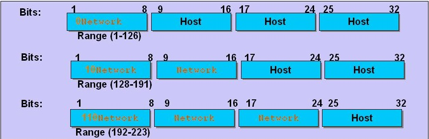

## java基础之网络编程

网络编程就是在两个或两个以上的设备(例如计算机)之间传输数据。程序员所作的事情就是把数据发送到指定的位置，或者接收到指定的数据，这个就是狭义的网络编程范畴

<!-- more -->

### 一、网络基本概念

1. 网络通信协议

   计算机网络中实现通信的一些约定即通信协议，对速率、传输代码、代码结构、传输控制步骤、出错控制等指定的标准

2. 网络通信接口

   两个节点之间进行信息交流的接口，接口包括两部分：

   - 硬件装置：实现节点之间的信息传送
   - 软件装置：规定双方实现通信的约定协议

3. 通信协议分层

   协议的复合方式是层次方式，同层间可以通信，上一层可以调用下一层，与下下一层不发生关系，各层互不影响，利于系统的开发和扩展

4. IP协议

   Internet Protocol协议网络层的主要协议，支持网间互连的数据报通信。它提供的主要功能有：

   - 无连接数据报传送

   - 数据报路由选择和差错控制

   - 网络号+主机号分为a、b、c类网

     

5. 端口

   同一个ip地址上的不同的应用程序叫端口，分为TCP端口和UDP端口，TCP和UDP端口是分开的，分别有65536个

### 二、OSI模型

OSI是Open System Interconnect，意为开放式系统互连，国际标准。

| OSI   | TCP/IP      |
| ----- | ----------- |
| 应用层   | 应用层         |
| 表示层   |             |
| 会话层   |             |
| 传输层   | 传输层(tcp/ip) |
| 网络层   | 网络层（ip）     |
| 数据链路层 |             |
| 物理层   | 物理+数据链路层    |

#### 1. 物理层

#### 2. 数据链路层

#### 3. 网络层

#### 4. 传输层

#### 5. 会话层

#### 6. 表示层

#### 7. 应用层

### 三、TCP/UDP协议

TCP是transmission control protocol缩写，是专门设计用于在不可靠的因特网上提供可靠的，端到端的字节流通信的协议，是一种面向连接的协议。TCP连接的是字节流而非报文流。TCP负责发现传输的问题，一有问题就发出信号，要求重新传输，直到所有数据安全正确地传输到目的地。基于TCP/IP协议的应用程序分客户端和服务器端两部分

TCP/IP特点：

- TCP/IP协议仅支持点对点通信，同一台消息不能同时发给多台计算机
- TCP/IP协议在通信前必须建立连接才能通信
- 在通信连接建立前，服务器端必须首先建立侦听，客户端才能发出连接请求。当连接建立后服务端和客户端都能发送、接收数据
- TCP/IP协议会保证数据的正确性和传递的顺序，可靠性高

UDP是user data protocol缩写，是ODI模型中一种无连接的传输层协议，UDP不提供数据包分组、组装、排序，UDP向应用程序提供了一种发送封装的原始IP数据包的方法，并且发送时无需建立连接，是不可靠的连接，但传输性能很高。网络视频会议系统这种客户/服务器模式的网络应用使用的是UDP协议

TCP和UDP的区别：

- 使用UDP时，每个数据报中都给出了完整的地址信息，因此无需要建立发送方和接收方的连接
- 对于TCP协议，由于它是一个面向连接的协议，在socket之间进行数据传输之前必然要建立连接，所以在TCP中多了一个连接建立的时间
- 使用UDP传输数据时是有大小限制的，每个被传输的数据报必须限定在64KB之内
- TCP没有这方面的限制，一旦连接建立起来，双方的socket就可以按统一的格式传输大量的数据
- UDP是一个不可靠的协议，发送方所发送的数据报并不一定以相同的次序到达接收方
- TCP是一个可靠的协议，它确保接收方完全正确地获取发送方所发送的全部数据
- TCP在网络通信上有极强的生命力，例如远程连接（Telnet）和文件传输（FTP）都需要不定长度的数据被可靠地传输
- 相比之下UDP操作简单，而且仅需要较少的监护，因此通常用于局域网高可靠性的分散系统中client/server应用程序

### 四、Socket

两个应用程序可通过一个双向的网络通信连接实现数据交换，这个双向链路的一端称为socket

1. socket用来实现client-server连接
2. java.net包中的Socket和ServerSocket分别实现client和server
3. 建立连接时所需的寻址信息为远程计算机的IP地址和端口号

#### TCP-socket

TCP-Socket通信模型：


示例1：

```java
//server端
public class TCPServer {
	public static void main(String[] args) throws Exception {
		ServerSocket ss = new ServerSocket(6666);
		while(true) {
			Socket s = ss.accept();//accept()阻塞式方法，没连接就一直等待
			System.out.println("a client connect!");
			DataInputStream dis = new DataInputStream(s.getInputStream());
			System.out.println(dis.readUTF());//readUTF()也是阻塞式方法，同步式的，
			dis.close();
			s.close();
		}
		
	}
}

//client端
public class TCPClient {
	public static void main(String[] args) throws Exception {
		Socket s = new Socket("127.0.0.1", 6666);
		OutputStream os = s.getOutputStream();
		DataOutputStream dos = new DataOutputStream(os);
		Thread.sleep(30000);
		dos.writeUTF("hello server!");
		dos.flush();
		dos.close();
		s.close();
	}
}
```

示例2：

```java
//点对点通讯
public class Talkserver{
	public static void main(String args[]){
		try{
			ServerSocket server = null;
			try{
				server = new ServerSocket(4700);
			}catch(Exception e){
				System.out.println("can not listen to:" + e);
				System.exit(0);
			}
			Socket socket = null;
			try{
				socket = server.accept();
			}catch(Exception e){
				System.out.println("Error:" + e);
				System.exit(0);
			}
			String line;
			BufferedReader is = new BufferedReader(new InputStreamReader(socket.getInputStream()));
			PrintWriter os = new PrintWriter(socket.getOutputStream());
			BufferedReader sin = new BufferedReader(new InputStreamReader(System.in));
			System.out.println("Client:" + is.readLine());
			line = sin.readLine();
			while (!line.equals("bye"))	{
				os.println(line);
				os.flush();
				System.out.println("Server:" + line);
				System.out.println("Client:" + is.readLine());
				line = sin.readLine();
			}
			is.close();
			os.close();
			socket.close();
			server.close();
		}catch(Exception e){
			System.out.println("Error" + e);
		}
	}
}

public class Talkclient{
	public static void main(String args[]){
		try{
			Socket socket = new Socket("127.0.0.1",4700);
			BufferedReader sin = new BufferedReader(new InputStreamReader(System.in));
			PrintWriter os = new PrintWriter(socket.getOutputStream());
			BufferedReader is = new BufferedReader(new InputStreamReader(socket.getInputStream()));
			String readline;
			readline = sin.readLine();
			while (!readline.equals("bye"))	{
				os.println(readline);
				os.flush();
				System.out.println("Client:" + readline);
				System.out.println("Server:" + is.readLine());
				readline = sin.readLine();
			}
			os.close();
			is.close();
			socket.close();
		}catch(Exception e){
			System.out.println("Error" + e);
		}
	}
}		
```

#### UDP-socket

示例：

```java
//传输long类型
public class TestUDPServer{
	public static void main(String args[]) throws Exception{
		byte buf[] = new byte[1024];
		DatagramPacket dp = new DatagramPacket(buf, buf.length);
		DatagramSocket ds = new DatagramSocket(5678);
		while(true){
			ds.receive(dp);
			ByteArrayInputStream bais = new ByteArrayInputStream(buf);
			DataInputStream dis = new DataInputStream(bais);
			System.out.println(dis.readLong());
		}
	}
}


public class TestUDPClient{
	public static void main(String args[]) throws Exception{
		long n = 10000L;
		ByteArrayOutputStream baos = new ByteArrayOutputStream();
		DataOutputStream dos = new DataOutputStream(baos);
		dos.writeLong(n);
		
		byte[] buf = baos.toByteArray();
		System.out.println(buf.length);
		
		DatagramPacket dp = new DatagramPacket(buf, buf.length, 
						    new InetSocketAddress("127.0.0.1", 5678));
		DatagramSocket ds = new DatagramSocket(9999);
		ds.send(dp);
		ds.close();
		
	}
}
```


### 五、基于URL的网络编程

1. 创建一个URL

   为了表示URL， java.net中实现了类URL。我们可以通过下面的构造方法来初始化一个URL对象：

   ```java
   public URL (String spec);
   //通过一个表示URL地址的字符串可以构造一个URL对象
   URL urlBase=new URL("http://www. 263.net/")

   public URL(URL context, String spec);
   //通过基URL和相对URL构造一个URL对象。
   URL net263=new URL ("http://www.263.net/");
   URL index263=new URL(net263, "index.html")

   public URL(String protocol, String host, String file);
   new URL("http", "www.gamelan.com", "/pages/Gamelan.net. html");

   public URL(String protocol, String host, int port, String file);
   URL gamelan=new URL("http", "www.gamelan.com", 80, "Pages/Gamelan.network.html");
   ```

   注意：类URL的构造方法都声明抛弃非运行时例外（MalformedURLException），因此生成URL对象时，我们必须要对这一例外进行处理，通常是用try-catch语句进行捕获

2. 解析一个URL

   一个URL对象生成后，其属性是不能被改变的，但是我们可以通过类URL所提供的方法来获取这些属性：

   ```java
   public String getProtocol() //获取该URL的协议名。
   public String getHost() //获取该URL的主机名。
   public int getPort() //获取该URL的端口号，如果没有设置端口，返回-1。
   public String getFile()// 获取该URL的文件名。
   public String getRef()// 获取该URL在文件中的相对位置。
   public String getQuery() //获取该URL的查询信息。
   public String getPath() //获取该URL的路径
   public String getAuthority() //获取该URL的权限信息
   public String getUserInfo() //获得使用者的信息
   　　　 public String getRef()获得该URL的锚
   ```

3. 从URL读取WWW网络资源

   ```java
   //当我们得到一个URL对象后，就可以通过它读取指定的WWW资源。这时我们将使用URL的方法openStream()，其定义为：
   InputStream openStream();
   　　
   openSteam()//与指定的URL建立连接并返回InputStream类的对象以从这一连接中读取数据。
   URL url = new URL("http://www.baidu.com");
   //使用openStream得到一输入流并由此构造一个BufferedReader对象
   BufferedReader br = new BufferedReader(new InputStreamReader( url.openStream()));
   String line = null;
   while(null != (line = br.readLine())){
   	System.out.println(line);
   }
   br.close();
   ```

### 六、客户端/服务端编程

#### 1. 客户端

**1） 建立网络连接**

客户端网络编程的第一步都是建立网络连接。在建立网络连接时需要指定连接到的服务器的IP地址和端口号，建立完成以后，会形成一条虚拟的连接，后续的操作就可以通过该连接实现数据交换了。

**2） 交换数据**

连接建立以后，就可以通过这个连接交换数据了。交换数据严格按照请求响应模型进行，由客户端发送一个请求数据到服务器，服务器反馈一个响应数据给客户端，如果客户端不发送请求则服务器端就不响应。

根据逻辑需要，可以多次交换数据，但是还是必须遵循请求响应模型。

**3） 关闭网络连接**

在数据交换完成以后，关闭网络连接，释放程序占用的端口、内存等系统资源，结束网络编程。

最基本的步骤一般都是这三个步骤，在实际实现时，步骤2会出现重复，在进行代码组织时，由于网络编程是比较耗时的操作，所以一般开启专门的现场进行网络通讯。

#### 2. 服务端

**（1） 监听端口**

服务器端属于被动等待连接，所以服务器端启动以后，不需要发起连接，而只需要监听本地计算机的某个固定端口即可。

这个端口就是服务器端开放给客户端的端口，服务器端程序运行的本地计算机的IP地址就是服务器端程序的IP地址。

**2） 获得连接**

当客户端连接到服务器端时，服务器端就可以获得一个连接，这个连接包含客户端的信息，例如客户端IP地址等等，服务器端和客户端也通过该连接进行数据交换。

一般在服务器端编程中，当获得连接时，需要开启专门的线程处理该连接，每个连接都由独立的线程实现。

**3）交换数据**

服务器端通过获得的连接进行数据交换。服务器端的数据交换步骤是首先接收客户端发送过来的数据，然后进行逻辑处理，再把处理以后的结果数据发送给客户端。简单来说，就是先接收再发送，这个和客户端的数据交换数序不同。

其实，服务器端获得的连接和客户端连接是一样的，只是数据交换的步骤不同。

当然，服务器端的数据交换也是可以多次进行的。

在数据交换完成以后，关闭和客户端的连接。

**4）关闭连接**

当服务器程序关闭时，需要关闭服务器端，通过关闭服务器端使得服务器监听的端口以及占用的内存可以释放出来，实现了连接的关闭。

#### 3. 一个基础的网络类——InetAddress类

该类的功能是代表一个IP地址，并且将IP地址和域名相关的操作方法包含在该类的内部。注：

- InetAddress 类没有明显的构造函数。为生成一个InetAddress对象，必须运用一个可用的工厂方法
- 工厂方法（factory method）仅是一个类中静态方法返回一个该类实例的约定。对于InetAddress，三个方法 getLocalHost( )、getByName( )以及getAllByName( )可以用来创建InetAddress的实例
- 如果这些方法不能解析主机名，它们引发一个UnknownHostException异常

### 七、TCP编程

java.net.Socket类代表客户端连接，以java.net.ServerSocket类代表服务器端连接。在进行网络编程时，底层网络通讯的细节已经实现了比较高的封装，所以在程序员实际编程时，只需要指定IP地址和端口号码就可以建立连接了

#### 1. 客户端

**1) 建立Socket连接**

```java
Socket socket = new Socket(“www.sohu.com”,80);
```

**2）按照“请求-响应”模型进行网络数据交换**

在Java语言中，数据传输功能由Java IO实现，也就是说只需要从连接中获得输入流和输出流即可，然后将需要发送的数据写入连接对象的输出流中，在发送完成以后从输入流中读取数据即可。示例代码如下：

```java
OutputStream os = socket1.getOutputStream(); //获得输出流
InputStream is = socket1.getInputStream(); //获得输入流
```

这里获得的只是最基本的输出流和输入流对象，还可以根据前面学习到的IO知识，使用流的嵌套将这些获得到的基本流对象转换成需要的装饰流对象，从而方便数据的操作。

**3）关闭网络连接**

```java
socket1.close();
```

#### 2. 服务端

**1）监听端口**

```java
ServerSocket ss = new ServerSocket(10000);
```

**2）获得连接**

当有客户端连接到达时，建立一个和客户端连接对应的Socket连 接对象，从而释放客户端连接对于服务器端端口的占用

```java
Socket socket = ss.accept();
```

该代码实现的功能是获得当前连接到服务器端的客户端连接。需要说明的是accept和前面IO部分介绍的read方法一样，都是一个阻塞方法，也就是当无连接时，该方法将阻塞程序的执行，直到连接到达时才执行该行代码。另外获得的连接会在服务器端的该端口注册，这样以后就可以通过在服务器端的注册信息直接通信，而注册以后服务器端的端口就被释放出来，又可以继续接受其它的连接了

**3）按照“请求-响应”模型进行网络数据交换**

这里获得的Socket类型的连接就和客户端的网络连接一样了，只是服务器端需要首先读取发送过来的数据，然后进行逻辑处理以后再发送给客户端，也就是交换数据的顺序和客户端交换数据的步骤刚好相反

```java
InputStream is = ss.getInputStream(); //获得输入流
OutputStream os = ss.getOutputStream(); //获得输出流
```

**4)关闭服务器端连接**

```java
ss.close();
```

### 八、UDP编程

用户数据报协议使用该种方式无需建立专用的虚拟连接，由于无需建立专用的连接，所以对于服务器的压力要比TCP小很多，所以也是一种常见的网络编程方式。但是使用该种方式最大的不足是传输不可靠，当然也不是说经常丢失，就像大家发短信息一样，理论上存在收不到的可能

在Java API中，实现UDP方式的编程，包含客户端网络编程和服务器端网络编程，主要由两个类实现，分别是：

**DatagramSocket**

DatagramSocket类实现“网络连接”，包括客户端网络连接和服务器端网络连接。虽然UDP方式的网络通讯不需要建立专用的网络连接，但是毕竟还是需要发送和接收数据，DatagramSocket实现的就是发送数据时的发射器，以及接收数据时的监听器的角色。类比于TCP中的网络连接，该类既可以用于实现客户端连接，也可以用于实现服务器端连接

**DatagramPacket**

DatagramPacket类实现对于网络中传输的数据封装，也就是说，该类的对象代表网络中交换的数据。在UDP方式的网络编程中，无论是需要发送的数据还是需要接收的数据，都必须被处理成DatagramPacket类型的对象，该对象中包含发送到的地址、发送到的端口号以及发送的内容等。其实DatagramPacket类的作用类似于现实中的信件，在信件中包含信件发送到的地址以及接收人，还有发送的内容等，邮局只需要按照地址传递即可。在接收数据时，接收到的数据也必须被处理成DatagramPacket类型的对象，在该对象中包含发送方的地址、端口号等信息，也包含数据的内容。和TCP方式的网络传输相比，IO编程在UDP方式的网络编程中变得不是必须的内容，结构也要比TCP方式的网络编程简单一些

#### 1. 客户端

**1）建立连接：**

```java
DatagramSocket ds = new DatagramSocket();//该客户端连接使用系统随机分配的一个本地计算机的未用端口号
DatagramSocket ds = new DatagramSocket(5000);//一般在建立客户端连接时没有必要指定端口号码。
```

**2）发送数据**

在发送数据时，需要将需要发送的数据内容首先转换为byte数组，然后将数据内容、服务器IP和服务器端口号一起构造成一个DatagramPacket类型的对象，这样数据的准备就完成了了，发送时调用网络连接对象中的send方法发送该对象即可

**3）UDP客户端编程中接收数据**

首先构造一个数据缓冲数组，该数组用于存储接收的服务器端反馈数据，该数组的长度必须大于或等于服务器端反馈的实际有效数据的长度。然后以该缓冲数组为基础构造一个DatagramPacket数据包对象，最后调用连接对象的receive方法接收数据即可。接收到的服务器端反馈数据存储在DatagramPacket类型的对象内部

**4）关闭连接**

```java
ds.close();
```

#### 2. 服务端

**1）首先UDP方式服务器端网络编程需要建立一个连接，该连接监听某个端口：**

```java
DatagramSocket ds = new DatagramSocket(10010);//由于服务器端的端口需要固定，所以一般在建立服务器端连接时，都指定端口号
```

**2）接收客户端发送过来的数据**

其接收的方法和客户端接收的方法一致，其中receive方法的作用类似于TCP方式中accept方法的作用，该方法也是一个阻塞方法，其作用是接收数据

```java
ds.receive();//接收数据。
```

接收到客户端发送过来的数据以后，服务器端对该数据进行逻辑处理，然后将处理以后的结果再发送给客户端，在这里发送时就比客户端要麻烦一些，因为服务器端需要获得客户端的IP和客户端使用的端口号，这个都可以从接收到的数据包中获得。示例代码如下：

```java
//获得客户端的IP
InetAddress clientIP = receiveDp.getAddress();
//获得客户端的端口号
Int clientPort = receiveDp.getPort();
```

**3)关闭连接**

```java
ds.close()
```


