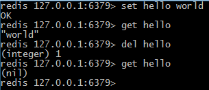
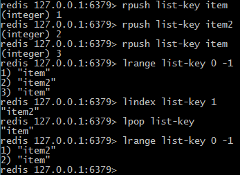
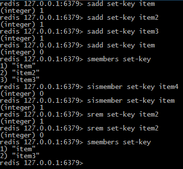
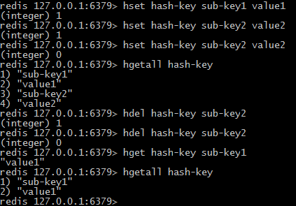
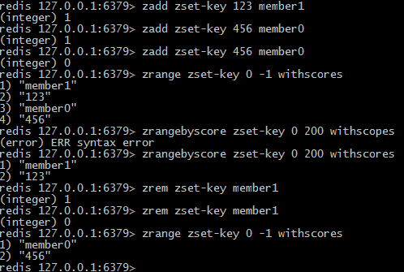

## Redis简介

**Redis**是一个速度非常快的非关系数据库（non-relational database），它能够自动以两种不同的方式将数据写入硬盘，可以存储键与5种不同类型的值之间的映射，可以将存储在内存的键值对数据持久化到硬盘，可以使用复制特性来扩展读性能，还可以使用客户端分片来扩展写性能。Redis不使用表，它的数据库也不会预定义或者强制去要求用户对Redis存储的不同数据进行关联。

分片是一种将数据划分为多个部分的方法，对数据的划分可以基于键包含的ID、基于键的散列值，或者基于以上两者的某种组合。通过对数据进行分片，用户可以将数据存储到多台机器里面，也可以从多台机器里面获取数据，这种方法在解决某些问题时可以获得线性级别的性能提升。

<!-- more -->

一些数据库和缓存服务器的对比：

|     名称     |            类型            |             数据存储选项             |                   查询类型                   |                   附加功能                   |
| :--------: | :----------------------: | :----------------------------: | :--------------------------------------: | :--------------------------------------: |
|   Redis    | 使用内存存储（in-memory）的非关系数据库 |       字符串、列表、集合、散列表、有序集合       | 每种数据类型的专属命令，批量操作（bulkoperation）和不完全（partial）的事务支持 | 发布与订阅，主从复制（master/slave replication），持久化，脚本（存储过程） |
| memcached  |       使用内存存储的键值缓存        |            键值之间的映射             |           创建、读取、更新、删除以及其他几个命令            |              为提升性能而设的多线程服务器              |
|   MySQL    |          关系数据库           | 可以处理多个表的视图，支持空间（spatial）和第三方扩展 |                 函数、存储过程                  |      支持ACID性质（需要使用InnoDB），主从复制和主主复制      |
| PostgreSQL |          关系数据库           |            支持可定制类型             |              内置函数、自定义的存储过程               | 支持ACID性质，主从复制，由第三方支持的多主复制（multi-master replication） |
|  MongoDB   | 使用硬盘存储（on-disk）的非关系文档存储  |    每个表可以包含多个无schema的BSON文档     |           创建、读取、更新、删除、条件查询命令等            | 支持map-reduce操作，主从复制，分片，空间索引（spatial index） |

**当服务器被关闭时，服务器存储的数据将何去何从？**

Redis拥有两种持久化方法，用小而紧凑的格式将存储在内存中的数据写入硬盘：

1. 时间点转储（point-in-time dump）：转储操作既可以在“指定时间段内有指定数量的写操作执行”这一条件被满足时执行；又可以通过调用两条转储到硬盘命令中的任何一条来执行；
2. 追加：将所有修改了数据库的命令都写入一个只追加（append-only）文件里面，用户可以根据数据的重要程度，将只追加写入设置为从不同步（sync）、每秒同步一次或者每写入一个命令就同步一次。

Redis实现了主从复制：

执行复制的从服务器会连接上主服务器，接受主服务器发送的整个数据库的初识副本（copy）；之后主服务器执行的写命令，都会被发送到所有连接着的从服务器去执行，从而实时地更新从服务器的数据集。因为从服务器包含的数据会不断地进行更新，所以客户端可以向任意一个从服务器发送读请求，以此来避免对主服务器进行集中式的访问。

## Redis数据结构

Redis提供的5中结构：

|  结构类型  |                  结构存储的值                  |                 结构的读写能力                  |
| :----: | :--------------------------------------: | :--------------------------------------: |
| STRING |              可以是字符串、整数或者浮点数              | 对整个字符串或者字符串的其中一部分执行操作；对整数和浮点数执行自增（increment）或者自减（decrement）操作 |
|  LIST  |          一个链表，链表上的每个节点都包含了一个字符串          | 从链表的两端推入或者弹出元素；根据偏移量对链表进行修剪（trim）；读取单个或者多个元素；根据值查找或者移除元素 |
|  SET   | 包含字符串的无序收集器（unordered collection），并且被包含的每个字符串都是独一无二、各不相同 | 添加、获取、移除单个元素；检查一个元素是否存在于集合中；计算交集、并集、差集；从集合中随机获取元素 |
|  HASH  |               包含键值对的无序散列表                |          添加、获取、移除单个键值对；获取所有的键值对          |
|  ZSET  | 字符串成员（member）与浮点数分值（score）之间的有序映射，元素的排列顺序由分值的大小决定 |   添加、获取、删除单个元素；根据分值范围（range）或者成员来获取元素    |

### 字符串

Redis的字符串和其他键值存储提供的字符串类似。

字符串命令：

|  命令  |     行为      |
| :--: | :---------: |
| GET  | 获取存储在给定键中的值 |
| SET  | 设置存储在给定键中的值 |
| DEL  | 删除存储在给定键中的值 |

使用示例：

### 列表

Redis支持链表结构。一个列表结构可以有序地存储多个字符串。

列表命令：

|     命令      |       行为        |
| :---------: | :-------------: |
| RPUSH/LPUSH | 将给定值推入列表的右端/左端  |
|   LRANGE    | 获取列表在给定范围上的所有值  |
|   LINDEX    | 获取列表在给定位置上的单个元素 |
|  LPOP/RPOP  |  从列表的左端/右端弹出元素  |

使用示例：

说明：

- 在向列表推入新元素之后，rpush命令会返回列表当前的长度；
- 使用0为范围的起始索引，-1为范围的结束索引，可以取出列表包含的所有元素；
- 从列表里面弹出一个元素，被弹出的元素将不再存在于列表。

### 集合

Redis的集合和列表都可以存储多个字符串，它们之间的不同在于，列表可以存储多个相同的字符串，而集合则通过使用散列表来保证存储的字符串各不相同（这些散列表只有键，但没有与键相关联的值）。

集合命令：

|    命令     |          行为          |
| :-------: | :------------------: |
|   SADD    |      将给定元素添加到集合      |
| SMEMBERS  |     返回集合包含的所有元素      |
| SISMEMBER |   检查给定的元素是否存在于集合中    |
|   SREM    | 如果给定的元素存在于集合中，移除这个元素 |

使用示例：

说明：

- 添加元素到集合，返回命令1表示成功，0表示该元素已经存在；
- 使用命令移除集合中元素时，命令会返回被移除元素的数量。

### 散列表

Redis的散列可以存储多个键值之间的映射。和字符串一样，散列存储的值既可以是字符串也可以是数字值，并且用户可以对散列存储的数字值执行自增或自减操作。

散列命令：

|   命令    |       行为       |
| :-----: | :------------: |
|  HSET   | 在散列里面关联起给定的键值对 |
|  HGET   |   获取指定散列键的值    |
| HGETALL |  获取散列包含的所有键值对  |
|  HDEL   |     移除给定键      |

使用示例：

说明：

- 在添加/删除键值对在散列表时，命令会返回一个值来表示添加/删除之前是否存在于散列表里面。

### 有序集合

有序集合和散列一样，都用于存储键值对。有序集合的键被称为成员（member），每个成员都是各不相同的；有序集合的值则被称为分值（score），分值必须为浮点数。有序集合是Redis里面唯一一个既可以根据成员访问元素（和散列一样），又可以根据分值以及分值的排序顺序来访问元素的结构。

有序集合命令：

|      命令       |              行为               |
| :-----------: | :---------------------------: |
|     ZADD      |     将一个带有给定分值的成员添加到有序集合里面     |
|    ZRANGE     | 根据元素在有序排序中所处的位置，从有序集合里面获取多个元素 |
| ZRANGEBYSCORE |      获取有序集合在给定分值范围内的所有元素      |
|     ZREM      |            移除给定成员             |

使用示例：

说明：

- 在获取有序集合包含的所有元素时，多个元素会按照分值大小排序；
- 用户可以根据分值来获取有序集合中的一部分元素。

## Redis应用

