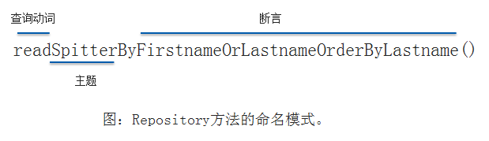

## 介绍

在数据持久化的世界中， JDBC能很好地完成份内的事并且在一些特定的场景下表现出色。 但此外，我们还需要一些更复杂的特性：

- 延迟加载（*Lazy loading*） ： 有时候我们并不希望立即获取完整的对象间关系。 举一个典型的例子， 假设我们在查询一组PurchaseOrder对象， 而每个对象中都包含一个LineItem对象集合。 如果我们只关心PurchaseOrder的属性， 那查询出LineItem的数据就毫无意义。 而且这可能是开销很大的操作。 延迟加载允许我们只在需要的时候获取数据。
- 预先抓取（*Eager fetching*） ： 这与延迟加载是相对的。 借助于预先抓取， 我们可以使用一个查询获取完整的关联对象。 如果我们需要PurchaseOrder及其关联的LineItem对象， 预先抓取的功能可以在一个操作中将它们全部从数据库中取出来， 节省了多次查询的成本。
- 级联（*Cascading*） ： 更改数据库中的表会同时修改其他表。当删除Order对象时， 需要同时删除关联的LineItem。

一些可用的框架提供了这样的服务， 这些服务的通用名称是**对象/关系映射（object-relational mapping， ORM）**。

<!-- more -->

Spring对多个持久化框架都提供了支持， 包括**Hibernate**、 **iBATIS**、**Java数据对象（ Java Data Objects， JDO）** 以及**Java持久化API（ JavaPersistence API， JPA）** 。 与Spring对JDBC的支持那样， Spring对ORM框架的支持提供了与这些框架的集成点以及一些附加的服务：

- 支持集成Spring声明式事务；
- 透明的异常处理；
- 线程安全的、 轻量级的模板类；
- DAO支持类；
- 资源管理。

## Spring中集成Hibernate

Hibernate不仅提供了基本的对象关系映射， 还提供了ORM工具所应具有的所有复杂功能，比如缓存、 延迟加载、 预先抓取以及分布式缓存。

### 声明**Hibernate**的**Session**工厂

使用Hibernate所需的主要接口是org.hibernate.Session。 Session接口提供了基本的数据访问功能， 如保存、 更新、 删除以及从数据库加载对象的功能。获取Hibernate Session对象的标准方式是借助于Hibernate SessionFactory接口的实现类。在Spring中， 我们要通过Spring的某一个Hibernate Session工厂bean来获取Hibernate SessionFactory。 从3.1版本开始， Spring提供了三个Session工厂bean供我们选择：

- org.springframework.orm.hibernate3.LocalSessionFactoryBean
- org.springframework.orm.hibernate3.annotation.AnnotationSessionFactoryBean
- org.springframework.orm.hibernate4.LocalSessionFactoryBean

至于选择使用哪一个Session工厂， 这取决于使用哪个版本的Hibernate以及你使用XML还是使用注解来定义对象-数据库之间的映射关系。

~~~java
//使用Hibernate 3.2或更高版本(不包括4及以上) 并且使用XML定义映射，使用第一个
@Bean
public LocalSessionFactoryBean sessionFactory(DataSource dataSource){
  	LocalSessionFactoryBean sfb = new LocalSessionFactoryBean();
  	sfb.setDataSource(dataSource); //属性dataSource装配了一个DataSource bean的引用
  	sfb.setMappingResources(new String[] {"Spitter.hbm.xml"}); //一个或多个的Hibernate映射文件， 在这些文件中定义了应用程序的持久化策略
  	Properties props = new Properties(); //hibernateProperties属性配置了Hibernate如何进行操作的细节
  	props.setProperty("dialect","org.hibernate.dialect.H2Dialect");
  	sfb.setHibernateProperties(props);
  	return sfb;
}

//使用注解的方式定义持久化(不包括4及以上)，可以使用第二个
@Bean
public AnnotationSessionFactoryBean sessionFactory(DataSource ds){
  	AnnotationSessionFactoryBean sfb = new AnnotationSessionFactoryBean();
  	sfb.setDataSource(ds); 
  	sfb.setPackagesToScan(new String[] {"com.habuma.spitter.domain"}); 
  	Properties props = new Properties(); 
  	props.setProperty("dialect","org.hibernate.dialect.H2Dialect");
  	sfb.setHibernateProperties(props);
  	return sfb;
}

//使用Hibernate 4,可以使用第三个。能够支持基于XML的映射和基于注解的映射
@Bean
public LocalSessionFactoryBean sessionFactory(DataSource dataSource){
  	LocalSessionFactoryBean sfb = new LocalSessionFactoryBean();
  	sfb.setDataSource(dataSource); 
  	sfb.setPackagesToScan(new String[] {"com.habuma.spitter.domain"}); 
    /*还可以使用annotatedClasses属性来将应用程序中所有的持久化类以全限定名的方式明确列出：
    sfb.setAnnotatedClasses(new Class<?>[]{Spitter.class, Spittle.class});
    */
  	Properties props = new Properties(); 
  	props.setProperty("dialect","org.hibernate.dialect.H2Dialect");
  	sfb.setHibernateProperties(props);
  	return sfb;
}

/*
使用packagesToScan属性告诉Spring扫描一个或多个包以查找域类， 这些类通过注解的方式表明要使用Hibernate进行持久化， 这些类可以使用的注解包括JPA的@Entity或@MappedSuperclass以及Hibernate的@Entity
*/
~~~

### 构建不依赖于**Spring**的**Hibernate**代码

使用上下文**Session（ Contextual session）**。 通过这种方式， 会直接将**Hibernate SessionFactory**装配到**Repository**中， 并使用它来获取**Session**。例：借助**Hibernate Session**实现不依赖于**Spring**的**Repository**

~~~java
/*
 * @Repository是Spring的另一种构造性注解， 它能够像其他注解一样被Spring的组件扫描所扫描到
 * 好处：1. 减少显式配置以外--不必声明HibernateSpitterRepository bean
 *      2. 异常处理
 */
@Repository
public class HibernateSpitterRepository{
  	/*
  	 * 通过@Inject注解让Spring自动将一个SessionFactory注入
  	 */
  	@Inject
  	public HibernateSpitterRepository(SessionFactory sessionFactory){
  		this.sessionFactory = sessionFactory;//注入SessionFactory
	}
  	private Session currentSession(){
      	return SessionFactory.getCurrentSession();//从SessionFactory中获取当前Session
  	}
  	public long count(){
      	return findAll().size();
  	}
  	public Spitter save(Spitter spitter){
      	Serializable id = currentSession().save(spitter);//使用当前Session
      	return new Spitter((Long) id,
                          spitter.getUsername(),
                          spitter.getPassword(),
                          spitter.getFullName(),
                          spitter.getEmail(),
                          spitter.isUpdateByEmail());
  	}
  	public Spitter findOne(long id){
      	return (Spitter) currentSession().get(Spitter.class,id);
  	}
  	public Spitter findByUsername(String username){
      	return (Spitter) currentSession().createCriteria(Spitter.class)
          .add(Restrictions.eq("username",username)).list().get(0);
  	}
  	public List<Spitter> findAll(){
      	return (List<Spitter>) currentSession().createCriteria(Spitter.class).list();
  	}
}

~~~

@Repository注解处理异常：

为了给不使用模板的**Hibernate Repository**添加异常转换功能， 我们只需在Spring应用上下文中添加一个**PersistenceExceptionTranslationPostProcessor bean**：

~~~java
@Bean
public BeanPostProcessor persistenceTranslation(){
  	return new PersistenceExceptionTranslationPostProcessor();
}
/*
 * PersistenceExceptionTranslationPostProcessor是一个bean 后置处理器（bean post-processor），它会在所有拥有   *@Repository注解的类上添加一个通知器（advisor），这样就会捕获任何平台相关的异常并以Spring非检查型数据访问异常
  * 的形式重新抛出。
 */
~~~

上面是**Hibernate**版本的**Repository**，没有依赖**Spring**的特定类（ 除了**@Repository**注解以外 ）。 这种不使用模板的方式也适用于开发纯粹的基于**JPA**的**Repository**

## Spring与Java持久化API

Java持久化API（ Java Persistence API， JPA） 诞生在EJB 2实体Bean的废墟之上， 并成为下一代Java持久化标准。 **JPA **是基于POJO的持久化机制。在Spring中使用JPA的第一步是要在Spring应用上下文中将实体管理器工厂**（ entity manager factory）** 按照bean的形式来进行配置。

### 配置实体管理器工厂

基于**JPA**的应用程序需要使用**EntityManagerFactory**的实现类来获取**EntityManager**实例。 JPA定义了两种类型的实体管理器：

- **应用程序管理类型（ *Application-managed*） **： 当应用程序向实体管理器工厂直接请求实体管理器时， 工厂会创建一个实体管理器。 在这种模式下， 程序要负责打开或关闭实体管理器并在事务中对其进行控制。 这种方式的实体管理器适合于不运行在JavaEE容器中的独立应用程序。
- **容器管理类型（ *Container-managed*）** ： 实体管理器由Java EE创建和管理。 应用程序根本不与实体管理器工厂打交道。 相反， 实体管理器直接通过注入或JNDI来获取。 容器负责配置实体管理器工厂。 这种类型的实体管理器最适用于Java EE容器， 在这种情况下会希望在persistence.xml指定的JPA配置之外保持一些自己对JPA的控制。

以上的两种实体管理器实现了同一个**EntityManager**接口。  应用程序管理类型的**EntityManager**是由**EntityManagerFactory**创建的， 而**EntityManagerFactory**是通过**PersistenceProvider**的**createEntityManagerFactory()**方法得到的。 而容器管理类型的**Entity ManagerFactory**是通过**PersistenceProvider**的**createContainerEntityManager Factory()**方法获得的。

如果你使用的是**应用程序管理类型**的实体管理器， Spring承担了应用程序的角色并以透明的方式处理EntityManager； 在**容器管理**的场景下， Spring会担当容器的角色。这两种实体管理器工厂分别由对应的Spring工厂Bean创建：

- **LocalEntityManagerFactoryBean**生成应用程序管理类型的EntityManager-Factory。
- **LocalContainerEntityManagerFactoryBean**生成容器管理类型的Entity-ManagerFactory。

应用程序管理类型和容器管理类型的实体管理器工厂之间唯一值得关注的区别是在Spring应用上下文中如何进行配置。 

#### 配置应用程序管理类型的JPA

对于应用程序管理类型的实体管理器工厂来说， 它绝大部分配置信息来源于一个名为persistence.xml的配置文件。 这个文件必须位于类路径下的META-INF目录下。persistence.xml的作用在于定义一个或多个持久化单元。 持久化单元是同一个数据源下的一个或多个持久化类。 简单来讲，persistence.xml列出了一个或多个的持久化类以及一些其他的配置如数据源和基于XML的配置文件。 如下是一个典型的persistence.xml文件， 它是用于Spittr应用程序的：

~~~java
<persistence xmlns="http://java.sun.com/xml/ns/persistence" version="1.0">
  	<persistence-unit name="spitterPU">
  		<class>com.habuma.spittr.domain.Spitter</class>
        <class>com.habuma.spittr.domain.Spittle</class>
        <properties>
          	<property name="toplink.jdbc.driver" value="org.hsqldb.jdbcDriver" />
            <property name="toplink.jdbc.url" value="jdbc.hsqldb:hsql://localhost/spitter/spitter" />
            <property name="toplink.jdbc.user" value="sa" />
            <property name="toplink.jdbc.password" value="" />
        </properties>
  	</persistence-unit>
/persistence>
~~~

可以通过以下的@Bean注解方法在Spring中声明LocalEntityManagerFactoryBean：

~~~java
@Bean
public LocalEntityManagerFactoryBean entityManagerFactoryBean(){
  	LocalEntityManagerFactoryBean emfb = new LocalEntityManagerFactoryBean();
  	emfb.setPersistenceUnitName("spitterPU");
  	return emfb;
}
/*
 * 赋给persistenceUnitName属性的值就是persistence.xml中持久化单元的名称
 */
~~~

#### 使用容器管理类型的JPA

借助于Spring对JPA的支持， 再将配置信息放在persistence.xml中就显得不那么明智了。 实际上， 这样做妨碍了我们
在Spring中配置EntityManagerFactory。所以我们常用下面这种方式。

容器管理的JPA采取了一个不同的方式。当运行在容器中时，可以使用容器（Spring） 的信息生成EntityManagerFactory。可以将数据源信息配置在Spring应用上下文中，例如， 如下的@Bean注解方法声明了在Spring中来配置容器管理类型的JPA：

~~~java
@Bean
public LocalContainerEntityManagerFactoryBean entityManagerFactory(DataSource dataSource,
                                                        JpaVendorAdapter JpaVendorAdapter){
  	LocalContainerEntityManagerFactoryBean emfb = new LocalContainerEntityManagerFactoryBean();
  	emfb.setDataSource(dataSource); //数据源也可以在persistence.xml中配置，但这里优先级更高
  	emfb.setJpaVendorAdapter(jpaVendorAdapter);
  	emfb.setPackagesToScan("com.habuma.spittr.domain");
  	return emfb;
}
/*
 * paVendorAdapter属性用于指明所使用的是哪一个厂商的JPA实现。 Spring提供了多个JPA厂商适配器：
 * 1. EclipseLinkJpaVendorAdapter
 * 2. HibernateJpaVendorAdapter
 * 3. OpenJpaVendorAdapter
 * 4. TopLinkJpaVendorAdapter（在Spring 3.1版本中， 已经将其废弃了）
 */
~~~

这里使用Hibernate作为JPA实现， 所以将其配置为Hibernate-JpaVendorAdapter：

~~~java
@Bean
public JpaVendorAdapter jpaVendorAdapter(){
  	HibernateJpaVendorAdapter adapter = new HibernateJpaVendorAdapter();
  	adapter.setDatabase("HSQL"); //表示使用的数据库是Hypersonic
  	adapter.setShowSql(true);
  	adapter.setGenerateDdl(false);
  	adapter.setDatabasePlatform("org.hibernate.dialect.HSQLDialect");
  	return adapter;
}
~~~

因为LocalContainerEntityManagerFactoryBean可以直接设置PackagesToScan属性，上例中，会扫描com.habuma.spittr.domain包， 查找带有@Entity注解的类。 因此， 没有必要在persistence.xml文件中进行声明了。 同时，因为DataSource也是注入到LocalContainer-EntityManager FactoryBean中的， 所以也没有必要在persistence.xml文件中配置数据库信息了。

#### 从**JNDI**获取实体管理器工厂

可以使用Spring jee命名空间下的<jee:jndi-lookup>元素来获取对EntityManagerFactory的引用：

~~~java
<jee:jndi-lookup id="emf" jndi-name="persistence/spitterPU" />
~~~

也可以使用如下的Java配置来获取EntityManagerFactory：

~~~java
@Bean
public JndiObjectFactoryBean entityManagerFactory(){
  	JndiObjectFactoryBean jndiObjectFB = new JndiObjectFactoryBean();
  	jndiObjectFB.setJndiName("jdbc/SpittrDS");
  	return jndiObjectFB; //JndiObjectFactoryBean是FactoryBean接口的实现， 它能够创建EntityManagerFactory
}
~~~

不管你采用何种方式得到EntityManagerFactory， 一旦得到这样的对象， 接下来就可以编写Repository了。 

### 编写基于JPA的Repository

纯粹的JPA方式远胜于基于模板的JPA，先看一个不使用**Spring**模板的纯**JPA Repository**：

~~~java
@Repository
@Transactional
public class JpaSpitterRepository implements SpitterRepository{
  	@PersistenceUnit
  	private EntityManagerFactory emf;  //注入EntityManagerFactory
  	public void addSpitter(Spitter spitter){
      	emf.createEntityManager().persist(spitter); //创建并使用EntityManager
  	}
  	public Spitter getSpitterById(long id){
      	return emf.createEntityManager().find(Spitter.class, id);
  	}
  	public Spitter saveSpitter(Spitter spitter){
      	emf.createEntityManager().merge(spitter);
  	}
}
/*使用@PersistenceUnit注解，spring会将EntityManagerFactory注入到Repository中，之后JpaSpitterRepository的方法
 *就能使用它来创建EntityManager，然后EntityManager可以针对数据库执行操作
 */
~~~

在JpaSpitterRepository中， 唯一的问题在于每个方法都会调用createEntityManager() ，所以EntityManager并不是线程安全的， 一般来讲并不适合注入到像Repository这样共享的单例bean中。 如下我们可以借助@PersistentContext注解为JpaSpitterRepository设置EntityManager。例：将EntityManager的代理注入到Repository之中 

~~~java
@Repository 
@Transactional //表明这个Repository中的持久化方法是在事务上下文中执行的
public class JpaSpitterRepository implements SpitterRepository{
  	@PersistentContext
  	private EntityManager em;  //注入EntityManager
  
  	public void addSpitter(Spitter spitter){
      	em.persist(spitter);   //使用EntityManager
  	}
  	public Spitter getSpitterById(long id){
      	return em.find(Spitter.class, id);
  	}
  	public Spitter saveSpitter(Spitter spitter){
      	em.merge(spitter);
  	}
}
/*@PersistenceContext并不会真正注入EntityManager,而是给了它一个EntityManager的代理。 真正的EntityManager是与
 * 当前事务相关联的那一个， 如果不存在这样的EntityManager的话， 就会创建一个新的。 这样的话， 我们就能始终以线程
 * 安全的方式使用实体管理器。
 */
~~~

 **注意1：**@PersistenceUnit和@PersistenceContext并不是Spring的注解， 它们是由JPA规范提供的。 必须要配置Spring的PersistenceAnnotationBeanPostProcessor。 如果已使用了<context:annotation-config>或<context:componentscan>， 这些配置元素会自动注册PersistenceAnnotationBeanPostProcessor bean。 否则的话，就需要显式地注册这个bean：

~~~java
@Bean
public PersistenceAnnotationBeanPostProcessor paPostProcessor(){
   return new PersistenceAnnotationBeanPostProcessor();
}
~~~

 **注意2：**对于@Repository注解， 它的作用与开发Hibernate上下文Session版本的Repository时是一致的。 由于没有使用模板类来处理异常， 所以我们需要为Repository添加@Repository注解这样PersistenceExceptionTranslationPostProcessor就会知道要将这个bean产生的异常转换成Spring的统一数据访问异常。 我们需要将其作为一个bean装配到Spring中 ：

~~~java
@Bean
public BeanPostProcessor persistenceTranslation(){
  	return new PersistenceExceptionTranslationPostProcessor();
}
~~~

## 借助Spring Data实现自动化的JPA Repository 

我们发现上面的程序还会直接与EntityManager 交互来查询数据库。Spring Data JPA能够终结这种一遍遍地编写相同的持久化方法，SpringData能够让我们只编写Repository接口就可以了。 根本就不再需要实现类了。例：

~~~java
public interface SpitterRepository extends JpaRepository<Spitter,Long>{}
~~~

 编写Spring Data JPA Repository的关键在于要从一组接口中挑选一个进行扩展。 这里， SpitterRepository扩展了Spring Data JPA的JpaRepository。 通过这种方 式， JpaRepository进行了参数化， 所以它就能知道这是一个用来持久化Spitter对象的Repository， 并且Spitter的ID类型为Long。 另外， 它还会继承18个执行持久化操作的通用方法， 如保存Spitter、 删除Spitter以及根据ID查询Spitter。 

为了要求Spring Data创建SpitterRepository的实现， 我们需要在Spring配置中添加一个元素。 例：启用Spring Data JPA： 

~~~java
<beans xmlns:jpa="http://www.springframework.org/schema/data/jpa"
  	xsi:schemaLocation="http://www.springframework.org/schema/data/jpa
      http://www.springframework.org/schema/data/jpa/spring-jpa-1.0.xsd">
	
	<jpa:repositories base-package="com.habuma.spittr.db" />
</beans>
~~~

同<context:component-scan>元素一样， <jpa:repositories>元素也需要指定一个要进行扫描的base-package。 不过， <context:component-scan>会扫描包（及其子包） 来查找带有@Component注解的类，而<jpa:repositories>会扫描它的基础包来查找扩展自SpringData JPA Repository接口的所有接口。 如果发现了扩展自Repository的接口， 它会自动生成（在应用启动的时候） 这个接口的实现。 

同样，如果使用java配置的话，需要添加@EnableJpaRepositories 注解：

~~~java
@Configuration
@EnableJpaRepositories(basePackages="com.habuma.spittr.db")
public class JpaConfiguration{...}
~~~

SpitterRepository接口， 它扩展自JpaRepository， 而JpaRepository又扩展自Repository标记接口（虽然是间接的） 。 因此， SpitterRepository就传递性地扩展了Repository接口， 也就是Repository扫描时所要查找的接口。 当Spring Data找到它后， 就会创建SpitterRepository的实现类， 其中包含了继承自JpaRepository、 PagingAndSortingRepository和CrudRepository的18个方法。**Repository的实现类是在应用启动的时候生成的**，也就是Spring的应用上下文创建的时候。 它并不是在构建时通过代码生成技术产生的， 也不是接口方法调用时才创建的。 

Spring Data JPA很棒的一点在于它能为Spitter对象提供18个便利的方法来进行通用的JPA操作， 而无需你编写任何持久化代码。 如果你的需求超过了它所提供的这18个方法的话，  Spring Data JPA提供了几种方式来为Repository添加自定义的方
法。 

### 定义查询方法

例：根据给定的username查找Spitter对象 

~~~java
public interface SpitterRepository extends JpaRepository<Spitter,Long>{
  	Spitter findByUsername(String username);
}
~~~

当创建Repository实现的时候， Spring Data会检查Repository接口的所有方法， 解析方法的名称， 并基于被持久化的对象来试图推测方法的目的。 本质上， Spring Data定义了一组小型的**领域特定语言（domainspecific language ， DSL）** ， 在这里， 持久化的细节都是通过Repository方法的签名来描述的。 

#### Repository方法

Repository方法是由一个动词、 一个可选的主题（Subject） 、 关键词By以及一个断言所组成。 如下图：

对大部分场景来说，主题会被省略。要查询的对象类型是通过如何参数化JpaRepository接口来确定的， 而不是方法名称中的主题。 如果主题的名称以Distinct开头的话， 那么在生成查询的时候会确保所返回结果集中不包含重复记录。 断言指定了限制结果集的属性 ，在断言中， 会有一个或多个限制结果的条件。 每个条件必须引用一个属性， 并且还可以指定一种比较操作。 其他比较操作：

- IsAfter、 After、 IsGreaterThan、 GreaterThan 、IsGreaterThanEqual、 GreaterThanEqual 
- IsBefore、 Before、 IsLessThan、 LessThan 
- IsLessThanEqual、 LessThanEqual
- IsBetween、 Between
- IsNull、 Null、IsNotNull、 NotNull
- IsIn、 In、IsNotIn、 NotIn
- IsStartingWith、 StartingWith、 StartsWith、IsEndingWith、 EndingWith、 EndsWith
- IsContaining、 Containing、 Contains
- IsLike、 Like、IsNotLike、 NotLike
- IsTrue、 True、IsFalse、 False
- Is、 Equals、IsNot、 Not 

要对比的属性值就是方法的参数。 完整的方法签名如下所示： 

~~~java
List<Spitter> readByFirstnameOrLastname(String first, String last);
~~~

要处理String类型的属性时， 条件中可能还会包含IgnoringCase或IgnoresCase， 两者是同义的。例：忽略大小写

~~~java
List<Spitter> readByFirstnameIgnoringCaseOrLastnameIgnoringCase(String first, String last);
~~~

或者使用替代方案：

~~~java
List<Spitter> readByFirstnameOrLastnameAllIgnoringCase(String first, String last);
~~~

**注意: **参数的名称是无关紧要的， 但是它们的顺序必须要与方法名称中的操作符相匹配。 

我们还可以在方法名称的结尾处添加OrderBy， 实现结果集排序。 例如， 我们可以按照lastname属性升序排列结果集： 

~~~java
List<Spitter> readByFirstnameOrLastnameOrderByLastnameAsc(String first, String last);
~~~

如果要根据多个属性排序的话， 只需将其依序添加到OrderBy中即可。 例如， 下面的样例中， 首先会根据lastname升序排列， 然后根据firstname属性降序排列： 

~~~java
List<Spitter> readByFirstnameOrLastnameOrderByLastnameAscFirstnameDesc(String first, String last);
~~~

下面列出几个符合方法命名约定的方法签名： 

~~~java
List<Pet> findPetbyBreedIn(List<String> breed);
int countProductsByDiscontinuedTrue();
List<Order> findByShippingDateBetween(Date start, Date end)
~~~

现在， 我们只需知道通过使用属性名和关键字构建Repository方法签名， 就能让Spring Data JPA生成方法实现， 完成几乎
所有能够想象到的查询。  

### 声明自定义查询 

当遇到方法名称表达预期的查询无法实现时，Spring Data能够让我们通过@Query注解来解决问题。例：查找E-mail地址是Gmail邮箱的Spitter

~~~java
@Query("select s from Spitter s where s.email like '%gmail.com' ")
List<Spitter> findAllGmailSpitters();
~~~

我们依然不需要编写findAllGmailSpitters()方法的实现， 只需提供查询即可， 让Spring Data JPA知道如何实现这个方法。 对于Spring Data JPA的接口来说， @Query是一种添加自定义查询的便利方式。 但是， 它仅限于单个JPA查询。 

### 混合自定义的功能 

有些时候， 我们需要Repository所提供的功能是无法用Spring Data的方法命名约定来描述的， 甚至无法用@Query注解设置查询来实现。 可能需要我们按照传统的方式来编写Repository方法： 也就是直接使用EntityManager。 当Spring Data JPA为Repository接口生成实现的时候， 它还会查找名字与接口相同， 并且添加了Impl后缀的一个类。 如果这个类存在的
话， Spring Data JPA将会把它的方法与Spring Data JPA所生成的方法合并在一起。 对于SpitterRepository接口而言， 要查找的类名为SpitterRepositoryImpl。 例：将活跃的Spitter用户升级为Elite状态的Repository方法：

~~~java
public class SpitterRepositoryImpl implements SpitterSweeper{
  @PersistenceContext
  private EntityManager em;
  public int eliteSweep(){
     String update= "UPDATE Spitter spitter set spitter.status= 'Elite' where spitter.status= 'Newbie' and spitter.id in (select s from spitter s where(select count(spittles)from s.spittles spittles) > 10000 ) "
     return em.creataQuery(update).executeUpdate();
  }
}
~~~

注意， SpitterRepositoryImpl并没有实现SpitterRepository接口。 Spring Data JPA负责实现。SpitterRepositoryImpl（将它与Spring Data的Repository关联起来的是它的名字） 实现了SpitterSweeper接口， 它如下所示： 

~~~java
public interface SpitterSweeper{
  	int eliteSweep();
}
~~~

我们还需要确保eliteSweep()方法会被声明在SpitterRepository接口中。 要实现这一点， 避免代码重复的简单方式就是修改SpitterRepository， 让它扩展SpitterSweeper： 

~~~java
public interface SpitterRepository extends JpaRepository<Spitter, Long>, SpitterSweeper{
   ...
}
~~~

Spring Data JPA将实现类与接口关联起来是基于接口的名称。 但是， Impl后缀只是默认的做法， 如果你想使用其他后缀的
话， 只需在配置@EnableJpa-Repositories的时候， 设置repositoryImplementationPostfix属性即可： 

~~~java
@EnableJpaRepositories(basePackages="com.habuma.spittr.db",repositoryImplementationPostfix="Helper")
/*我们将后缀设置成了Helper， Spring Data JPA将会查找名为SpitterRepository-Helper的类， 用它来匹配SpitterRepository接口。*/
~~~

如果在XML中使用<jpa:repositories>元素来配置Spring DataJPA的话， 我们可以借助repository-impl-postfix属性指定后
缀： 

~~~java
<jpa:repositories base-package="com.habum.spittr.db" repository-impl-postfix="Helper" />
~~~

