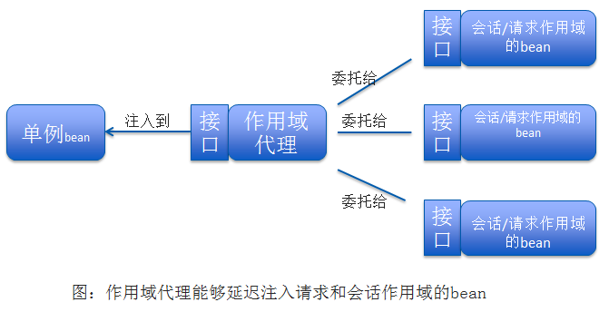

## 介绍

根据Spring提供的多种技巧，实现更为高级的bean装配功能。

<!-- more -->

## 环境与profile

### 配置profile bean

~~~java
import javax.sql.DataSource;
import org.springframework.context.annotation.Bean;
import org.springframework.context.annotation.Configuration;
import org.springframework.context.annotation.Profile;
import org.springframework.jdbc.datasource.embedded.EmbeddedDatabaseBuilder;
import org.springframework.jdbc.datasource.embedded.EmbeddedDatabaseType;
import org.springframework.jndi.JndiObjectFactoryBean;

@Configuration
public class DataSourceConfig {
  
 /*
  * 在开发环境下，使用的嵌入式数据库，预先加载数据
  * 为dev profile装配的bean
  */
  @Bean(destroyMethod = "shutdown")
  /*
   *  @Profile()注解指定某个bean属于哪一个profile。
   *  1. @Profile()注解可以使用在类上，也可以使用在方法级别上（3.2开始）
   *  2. @Profile()注解指定的dev profile激活才会创建相应的bean
   */
  @Profile("dev")
  public DataSource embeddedDataSource() {
    return new EmbeddedDatabaseBuilder()
        .setType(EmbeddedDatabaseType.H2)
        .addScript("classpath:schema.sql")
        .addScript("classpath:test-data.sql")
        .build();
  }
  
 /*
  * 生产环境，从JNDI容器中获取一个DataSource
  * 为prod profile装配bean
  */
  @Bean
  @Profile("prod")
  public DataSource jndiDataSource() {
    JndiObjectFactoryBean jndiObjectFactoryBean = new JndiObjectFactoryBean();
    jndiObjectFactoryBean.setJndiName("jdbc/myDS");
    jndiObjectFactoryBean.setResourceRef(true);
    jndiObjectFactoryBean.setProxyInterface(javax.sql.DataSource.class);
    return (DataSource) jndiObjectFactoryBean.getObject();
  }

  /*
   * 在QA环境，配置为Commons DBCP连接池
   */
//  @Bean(destroyMethod = "close")
//  public DataSource dataSource(){
//	  BasicDataSource dataSource = new BasicDataSource();
//	  dataSource.setUrl("jdbc:h2:tcp://dbserver/~/test");
//	  dataSource.setDriverClassName("org.h2.Driver");
//	  dataSource.setUserName("sa");
//	  dataSource.setPassword("password");
//	  dataSource.setInitialSize("20");
//	  dataSource.setMaxActive(30);
//	  
//	  return dataSource;
//  }
}
~~~

这三个版本的相同点是都会生成一个<javax.sql.DataSource的bean>。

### XML中配置profile

~~~java
<?xml version="1.0" encoding="UTF-8"?>
<beans xmlns="http://www.springframework.org/schema/beans"
  xmlns:xsi="http://www.w3.org/2001/XMLSchema-instance" xmlns:jdbc="http://www.springframework.org/schema/jdbc"
  xmlns:jee="http://www.springframework.org/schema/jee" xmlns:p="http://www.springframework.org/schema/p"
  xsi:schemaLocation="
    http://www.springframework.org/schema/jee
    http://www.springframework.org/schema/jee/spring-jee.xsd
    http://www.springframework.org/schema/jdbc
    http://www.springframework.org/schema/jdbc/spring-jdbc.xsd
    http://www.springframework.org/schema/beans
    http://www.springframework.org/schema/beans/spring-beans.xsd">

  <!--  dev profile -->
  <beans profile="dev">
    <jdbc:embedded-database id="dataSource" type="H2">
      <jdbc:script location="classpath:schema.sql" />
      <jdbc:script location="classpath:test-data.sql" />
    </jdbc:embedded-database>
  </beans>
  
  <!--  prod profile -->
  <beans profile="prod">
    <jee:jndi-lookup id="dataSource"
      lazy-init="true"
      jndi-name="jdbc/myDatabase"
      resource-ref="true"
      proxy-interface="javax.sql.DataSource" />
  </beans>
  
  <!--  qa profile -->
   <beans profile="qa">
    <bean id="dataSource" class="org.apache.commons.dbcp.BasicDataSource"
          destroy-method="close"
      	  p:url="jdbc:h2:tcp://dbserver/~/test"
          p:driverClassName="org.h2.Driver"
          p:userName="sa"
          p:password="password"
          p:initialSize="20"
          p:maxActive="30"
     />
  </beans>
</beans>
~~~

这里有三个bean，类型都是<javax.sql.DataSource>，并且ID都是dataSource。但运行时只会创建激活状态的profile的bean。

### 激活

profile激活需要依赖两个独立的属性：

1. <spring.profiles.active>

   先查找该文件，该文件的值就可以确定哪个profile的激活状态，如果该文件没有设置则查找default。

2. <spring.profiles.default>

   一般两个属性组合使用。

3. @ActiveProfiles注解：指定要激活的profile

   ~~~java
   @RunWith(SpringJUnit4ClassRunner.class)
   @ContextConfiguration(classes=TestConfig.class)
   @ActiveProfiles("dev")
   public class Test{
     
   }
   ~~~

## 条件化bean

@Conditional注解：用在带有@Bean注解的方法上。如果给定的条件计算结果为true，就会创建这个bean，否则，这个bean就会被忽略。例：

条件化配置bean

~~~java
@Bean
@Conditional(MagicExistsCondition.class)
public MagicBean magicBean() {
    return new MagicBean();
}
~~~

设置给@Conditional的类可以是任意实现了Condition接口的类型。实现matches方法，返回true或者false。

~~~java
public class MagicExistsCondition implements Condition {
  @Override
  public boolean matches(ConditionContext context, AnnotatedTypeMetadata metadata) {
    Environment env = context.getEnvironment();
    return env.containsProperty("magic");
  }
}
~~~

上面使用了ConditionContext接口：

~~~java
public interface ConditionContext{
  	BeanDefinitionRegistry getRegistry(); //检查bean定义
    ConfigurableListableBeanFactory getBeanFactory(); //检查bean是否存在，探查bean属性
    Environment getEnvironment(); //检查环境 变量是否存在以及它的值
    ResourceLoader getResourceLoader(); //读取ResourceLoader所加载的资源
    ClassLoader getClassLoader(); //加载并检查类是否存在
}

~~~

AnnotatedTypeMetadata接口：检查带有@Bean注解的方法上还有什么其他的注解

~~~java
public interface ConditionContext{
  	boolean isAnnotated(String annotationType);
}
~~~

### @Profile注解实现

从spring4开始，@Profile注解基于@Conditional和Condition实现。

@Profile注解如下所示：

~~~java
@Retention(RetentionPolicy.RUNTIME)
@Target({ElementType.TYPE, ElementType.METHOD})
@Documented
@Conditional(ProfileCondition.class)
public @interface Profile{
	String[] value();
}
~~~

@Profile注解使用了@Conditional注解，并且引用ProfileCondition作为Condition实现。

~~~java
public class ProfileCondition implements Condition{
	@Override
	public boolean matches(ConditionContext context, AnnotatedTypeMetadata metadata) {
		if(context.getEnvironment() != null){
			MultiValueMap<String, Object> attrs = metadata.getAllAnnotationAttributes(Profile.class.getName());
			if(attrs != null){
				for(Object value : attrs.get("value")){
					if(context.getEnvironment().acceptsProfiles(((String[]) value))){
						return true;
					}
				}
				return false;
			}
		}
		return false;
	}
}
~~~

ProfileCondition通过AnnotatedTypeMetadata得到了用于@Profile注解的所有属性。借助该信息，它会明确地检查value属性，该属性包含了bean的profile名称，然后，它根据通过ConditionContext得到的Environment来检查该profile是否处于激活状态。

## 处理自动装配的歧义性

在自动装配时，如果有多个bean匹配结果时，这时就会产生自动装配歧义。Spring会抛出<NoUniqueBeanDefinitionException>。Spring提供了多种方案解决这个问题，可以将可选bean中的某一个设为首选（primary）的bean，或者使用限定符（qualifier）将可选的bean范围缩小到只有一个bean。

### 标示首选的bean

@Primary能够与@Component组合用在组件扫描的bean上，也可以与@Bean组合用在java配置的bean声明中。

~~~java
@Component
@Primary
public class IceCream implements Dessert{
  
}

@Bean
@Primary
public Dessert iceCream(){
  	return new iceCream();
}
~~~

xml中使用：

~~~java
<bean id="iceCream" class="com.desserteater.IceCream" primary="true" />
~~~

首选项标示多个也有可能产生歧义性。对于解决歧义性问题，限定符更强大。

### 限定自动装配的bean

@Qualifier注解是使用限定符的主要方式，它可以与@Autowired和@Inject协同使用，在注入的时候指定想要注入进去的是哪一个bean。一般将beanID作为限定符。例：

~~~java
@Autowired
//iceCream参数是需要注入的bean的ID，缺点紧耦合，对类名（IceCream）改动容易导致限定符失效
@Qualifier("iceCream") 
public void setDessert(Dessert dessert){
  	this.dessert = dessert;
}
~~~

#### 创建自定义限定符

自定义限定符，最佳是为bean选择特性或描述性的术语。需要做的就是在bean声明上添加@Qualifier注解，可以与@Component注解组合使用，然后在注入的地方引用自定义限定符就可以。例：

~~~java
//声明时指定限定符为“cold”
@Component
@Qualifier("cold")
public class IceCream implements Dessert{
  
}

//注入时引用自定义限定符“cold”
@Autowired
@Qualifier("cold") 
public void setDessert(Dessert dessert){
  	this.dessert = dessert;
}
~~~

当通过java配置显示定义bean时，@Qualifier可以与@Bean注解一起使用。例：

~~~java
@Bean
@Qualifier("cold")
public Dessert iceCream(){
  	return new IceCream();
}
~~~

#### 使用自定义的限定符

自定义的面向特性的限定符要比基于beanID的限定符好一些。但如果自定义限定符存在多个的话也是会引起歧义的，而java不允许在同一条目上重复出现相同类型的多个注解（java8允许，只要这个注解本身在定义的时候带有@Repeatable注解就可以，但是Spring的@Qualifier注解并没有在定义时添加@Repeatable注解）。

解决方法是创建自定义限定符注解，它本身要使用@Qualifier注解来标注。例@Qualifier("cold")，我们使用自定义的@Cold注解，该注解定义为：

~~~java
@Target({ElementType.CONSTRUCTOR, ElementType.FIELD, ElementType.METHOD, ElementType.TYPE})
@Retention(RetentionPolicy.RUNTIME)
@Qualifier
public @interface Cold{
}
~~~

同样的，可以创建@Creamy注解

~~~java
@Target({ElementType.CONSTRUCTOR, ElementType.FIELD, ElementType.METHOD, ElementType.TYPE})
@Retention(RetentionPolicy.RUNTIME)
@Qualifier
public @interface Creamy{
}
~~~

使用时，在声明中添加上多个自定义限定符注解，注入时引用即可：

~~~java
//IceCream声明
@Component
@Cold
@Creamy
public class IceCream implements Dessert{
}

//Popsicle声明
@Component
@Cold
@Fruity
public class Popsicle implements Dessert{
}

//注入
@Autowired
@Cold
@Creamy
public void setDessert(Dessert dessert){
  	this.dessert = dessert;
}
~~~

## bean的作用域

在默认情况下，Spring应用上下文中所有bean都是作为以单例（singleton）的形式创建的。但如果你使用的类是易变的（mutable），它们会保持一些状态，因此重用是不安全的。这种情况将class声明为单例是不合理的，因为对象会被污染。

Spring定义了多种作用域，可以基于这些作用域创建bean，包括：

|      作用域      |                  描述                  |
| :-----------: | :----------------------------------: |
| 单例（Singleton） |         在整个应用中，只创建bean的一个实例          |
| 原型（Prototype） | 每次注入或者通过spring应用上下文获取，都会创建一个新的bean实例 |
|  会话（Session）  |       在Web应用中，为每个会话创建一个bean实例        |
|  请求（Request）  |       在Web应用中，为每个请求创建一个bean实例        |

可以使用@Scope注解设置bean的作用域。

- 组件扫描声明bean：

  ~~~java
  @Component
  @Scope(ConfigurableBeanFactory.SCOPE_PROTOTYPE)
  public class Notepad{
  }
  //也可以使用@Scope("prototype"),这样容易出错，SCOPE_PROTOTYPE是类型安全的
  ~~~

- java配置中声明bean

  ~~~java
  @Bean
  @Scope(ConfigurableBeanFactory.SCOPE_PROTOTYPE)
  public Notepad notepad() {
    	return new Notepad();
  }
  ~~~

- xml配置中声明bean

  ~~~java
  <bean id="notepad" class="com.spring.Notepad" scope="prototype" />
  ~~~

#### 使用会话和请求作用域

就购物车bean来说，会话作用域最合适，它与给定的用户关联性最大。可以使用@Scope注解：

~~~java
@Component
@Scope(value=WebApplicationContext.SCOPE_SESSION, //将作用域设置成会话
       proxyMode=ScopedProxyMode.INTERFFACES)
public ShoppingCart cart(){
}
~~~

上面@Scope注解还有用到一个属性proxyMode，表示作用域代理。理解下这个会话作用域。例：

~~~java
@Component
public class StoreService{
  	@Autowired
  	public void setShoppingCart(ShoppingCart shoppingCart){
      	this.shoppingCart = shoppingCart;
  	}
}
~~~

因为StoreService是一个单例的bean，会在spring应用上下文加载的时候创建。当它创建时，spring会试图将ShoppingCart注入到setShoppingCart()方法中。但是ShoppingCart bean是会话作用域的，此时并不存在，直到用户进入创建了会话才会出现ShoppingCart 的实例，此外，ShoppingCart 的实例有多个，我们不会让spring注入某个固定的ShoppingCart 的实例，我们希望注入的ShoppingCart 的实例恰好就是当前会话所对应的那一个。

Spring会注入一个ShoppingCart bean的代理，如下图：

这个代理会暴露与ShoppingCart相同的方法，所以StoreService会认为它就是一个购物车，但当StoreService调用ShoppingCart 的方法时，代理会对其进行懒解析并将调用委托给会话作用域内真正的ShoppingCart bean。

理解了上面作用域，下面看下proxyMode这个属性：

这个属性解决了将会话或请求的bean注入到单例bean中所遇到的问题。

> 1. ScopedProxyMode.INTERFFACES：表明这个代理要实现ShoppingCart 接口，并将调用委托给实现bean。
> 2. 如果ShoppingCart 是具体类的话，spring没办法创建基于接口的代理，它必须使用CGLib来生成基于类的代理。所以必须将proxyMode属性设置为ScopedProxyMode.TARGET_CLASS，表明要以生成目标类扩展的方式创建代理。

#### 在xml中声明作用域代理

在xml中设置代理模式，需要使用Spring aop命名空间的一个新元素：

~~~java
<bean id="cart" class="com.spring.ShoppingCart" scope="session">
  	<aop:scope-proxy /> //作用同@Scope,默认情况下使用CGLib创建目标类的代理
    //可以将proxy-target-class属性设置为false，进行基于接口的代理
    <aop:scope-proxy proxy-target-class="false" /> 
</bean>
~~~

使用<aop:scope-proxy>元素，需要在XML配置中声明Spring的aop命名空间：

~~~java
<?xml version="1.0" encoding="UTF-8"?>
<beans xmlns="http://www.springframework.org/schema/beans"
	xmlns:xsi="http://www.w3.org/2001/XMLSchema-instance"
	xmlns:aop="http://www.springframework.org/schema/aop"
    xsi:schemaLocation="http://www.springframework.org/schema/aop http://www.springframework.org/schema/aop/spring-aop.xsd                      http://www.springframework.org/schema/beans            http://www.springframework.org/schema/beans/spring-beans.xsd">
~~~

## 运行时值注入

为了避免硬编码，让硬编码的值在运行时再确定，Spring提供了两种运行时求值的方式：

- 属性占位符（Property placeholder）
- Spring表达式语言（SpEL）

### 属性占位符

在Spring中，处理外部值最简单的方式就是声明属性源并通过Spring的Environment来检索属性。例：一个基本的Spring配置类：

~~~java
/*
 * 引入资源文件
 */
@Configuration
@PropertySource("classpath:/com/spring/externals/app.properties") //声明属性源
public class ExpressiveConfig{
  	@Autowired
  	Environment env;
  	
  	@Bean
  	public BlankDisc disc(){
      	return new BlankDisc(
              env.getProperty("disc.title"),
          	  env.getProperty("disc.artist")
        );
  	}
}
~~~

@PropertySource引用了一个app.properties文件：

~~~java
disc.title=Sgt. Peppers Lonely Hearts Club Band
disc.artist=The Beatles
~~~

这个属性文件会加载到Spring的Environment中，可以调用getProperty()方法得到属性值。

#### 深入学习Spring的Environment

~~~java
/*
 *getProperty()方法的四种重载形式：
 */
String getProperty(String key);//属性没定义，获取到null
String getProperty(String key, String defaultValue);//默认值，例：env.getProperty("disc.title","hello")
T getProperty(String key, Class<T> type);
T getProperty(String key, Class<T> type, T defaultValue);
//获取连接池中所维持的连接数量
int connectionCount = env.getProperty("db.count", Integer.class, 30);

/*
 *其他方法
 */
String getRequiredProperty(String key); //属性必须定义，否则抛IllegalStateException异常
boolean containsProperty(String key); //检查某个属性是否存在
//将属性解析为类。例：
Class<CompactDisc> cdClass = env.getPropertyAsClass("disc.class",CompactDisc.class);

/*
 *检查profile激活的方法
 */
String[] getActiveProfiles(); //返回激活profile名称的数组
String[] getDefaultProfiles(); //返回默认profile名称的数组
boolean acceptsProfiles(String profiles);//如果environment支持给定profile的话，就返回true
~~~

#### 解析属性占位符

在Spring装配中，占位符的形式为使用“${...}”包装的属性名称。例：

XML中使用：

~~~java
/*
 * XML中配置并解析占位符
 */
<bean id="sgtPeppers"
  	  class="com.spring.BlankDisc"
      c:_title="${disc.title}"
      c:_artist="${disc.artist}" />
        
/*
 * 使用占位符
 * 使用xml配置生成PropertySourcePlaceholderConfigurer bean
 */
<context:property-placeholder />
//<context:property-placeholder location="com/spring/app.properties" />      
~~~

依赖组件扫描和自动装配：

~~~java
/*
 * java配置中配置并解析占位符
 */
//自动装配就没有指定占位符的配置文件或类，可以使用@Value注解
public BlankDisc(@Value("${disc.title}") String title, @Value("${disc.artist}") String artist){
  	this.title = title;
  	this.artist = artist;
}

/*
 * 使用占位符
 * 必须配置一个PropertySourcePlaceholderConfigurer bean,它能够基于Spring的Environment及其属性源解析占位符。如下的@Bean方法在java中配置
 */
@Bean
public static PropertySourcePlaceholderConfigurer placeholderConfigurer(){
  	return new PropertySourcePlaceholderConfigurer();
}
~~~

### Spring表达式语言

Spring表达式语言（Spring Expression Language, SpEL），它能够以一种强大和简介的方式将值装配到bean属性和构造器参数中，这个表达式会在运行时计算得到值。SpEL拥有很多特性，包括：

- 使用bean的ID来引用bean；
- 调用方法和访问对象的属性；
- 对值进行算术、关系和逻辑运算；
- 正则表达式匹配；
- 集合操作。

#### SpEL样例

SpEL表达式要放到#{...}之中，例：

~~~java
#{1} //数字常量，值为1
#{T(System).currentTimeMillis()}//当前时间的毫秒数
~~~

SpEL表达式也可以引用其他bean或其他bean的属性。引用系统属性。例：

~~~java
#{sgtPeppers.artist}//ID为sgtPeppers的bean的artist属性
#{systemProperties['disc.title']}//通过systemProperties对象引用系统属性
~~~

bean装配时使用表达式：

1. 通过组件扫描bean，在注入属性和构造器参数时，使用@Value注解。例：

   ~~~java
   //从系统属性中获取专辑和艺术家名字
   public BlankDisc(@Value("#{systemProperties['disc.title']}") String title,
                    @Value("#{systemProperties['disc.artist']}") String artist) {
     	this.title=title;
     	this.artist=artist;
   }
   ~~~

2. 在XML中，将SpEL表达式传入<property>或<constructor-arg>的value属性中，或者将其作为p-命名空间或c-命名空间条目的值。例：

   ~~~java
   <bean id="sgtPeppers" class="com.spring.BlankDisc"
     	c:_title="#{systemProperties['disc.title']}"
       c:_artist="#{systemProperties['disc.artist']}"
   />
   ~~~

下面学习SpEL所支持的基础表达式。

#### 表示字面值

SpEL不仅可以表示整数字面量，还可以表示浮点数、String值以及Boolean值。例：

~~~java
#{3.1415} //浮点数
#{9.87E4} //98700
#{'hello'} //String
#{false} //boolean
~~~

#### 引用bean、属性和方法

~~~java
//引用bean-将一个bean装配到另外一个bean的属性中，使用bean ID作为表达式
#{sgtPeppers}
//引用bean属性
#{sgtPeppers.artist}
//引用bean方法
#{artistSelector.selectArtist()}
//名称大写，这样可能出现NullPointerException
#{artistSelector.selectArtist().toUpperCase()}
//类型安全的运算符，返回值不为null才调用toUpperCase(),否则返回null
#{artistSelector.selectArtist()?.toUpperCase()}
~~~

#### 在表达式中使用类型

如果在SpEL中访问类作用域的方法和常量的话，要依赖T()这个关键运算符。T()运算符的结果表示一个Class对象。例：

~~~java
//代表java.lang.Math类
T(java.lang.Math)
//将PI值装配到bean属性中
T(java.lang.Math).PI
//调用静态方法和常量
T(java.lang.Math).random()
~~~

#### SpEL运算符

用来操作表达式值的SpEL运算符：

| 运算符类型 |             运算符             |
| :---: | :-------------------------: |
| 算术运算  |         +、-、*、/、%、^         |
| 比较运算  | <、>、==、<=、>=、it、gt、eq、le、ge |
| 逻辑运算  |        and、or、not、\|        |
| 条件运算  |   ?: (ternary)、?: (Elvis)   |
| 正则表达式 |           matches           |

例：

~~~java
//计算circle bean所定义的圆的周长
#{2 * T(java.lang.Math).PI * circle.radius}
//计算圆面积
#{T(java.lang.Math).PI * circle.radius ^ 2}
//String类型使用 + 表示连接
#{disc.title + 'by' + disc.artist}
//比较运算符中和文本符号效果相同
#{counter.total == 100}
#{counter.total eq 100}
//三元运算符检查null值
#{scoreboard.score > 1000 ? "Winner" : "Loser"}
#{disc.title ?: 'Hello'} //默认替代null，如果disc.title为null，则表达式值为Hello
~~~

#### 计算正则表达式

SpEL通过matches运算符支持表达式中的模式匹配。例：

~~~java
#{admin.email matches '[a-zA-Z0-9._%+-]+@[a-zA-Z0-9.-]+\\.com'}
~~~

#### 计算集合

SpEL可以操作集合和数组。例：

1. 引用列表中的一个元素：

   ~~~java
   #{jukebox.songs[4].title} //计算集合中第五个元素
   ~~~

2. 随机播放歌曲：

   ~~~java
   //[]运算符用来从集合或数组中按照索引获取元素
   #{jukebox.songs[T(java.lang.Math).random() * jukebox.songs.size()].title}
   ~~~

3. 从String中获取一个字符：

   ~~~java
   #{'This is a test'[3]}//获得“s”
   ~~~

4. 查询运算符（.?[]），对集合进行过滤，得到集合的一个子集：

   ~~~java
   //得到jukebox中artist属性为Aerosmith的所有歌曲
   #{jukebox.songs.?[artist eq 'Aerosmith']}
   ~~~

5. 查询运算符（.^[]）和（.$[]）分别用来在集合中查询第一个匹配项和最后一匹配项：

   ~~~java
   //查找列表中第一个artist属性为Aerosmith的歌曲
   #{jukebox.songs.^[artist eq 'Aerosmith']}
   ~~~

6. 投影运算符（.![]），从集合的每个成员中选择特定的属性放到另外一个集合中。例：

   ~~~java
   //获得所有歌曲名称的集合，而不是所有歌曲对象的集合
   #{jukebox.songs.![title]}
   ~~~

   实际上，投影运算符可以与其他任意的SpEL运算符一起使用。例：使用如下表达式获得Aerosmith所有歌曲的名称列表：

   ~~~java
   #{jukebox.songs.?[artist eq 'Aerosmith'].![title]}
   ~~~

   ​