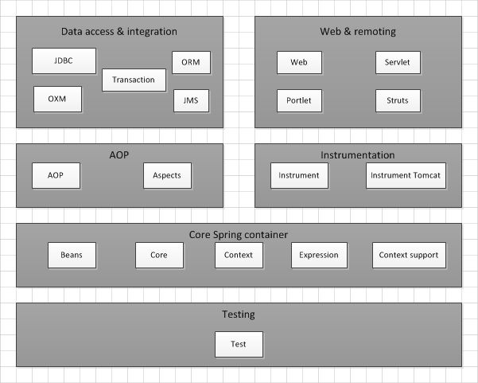
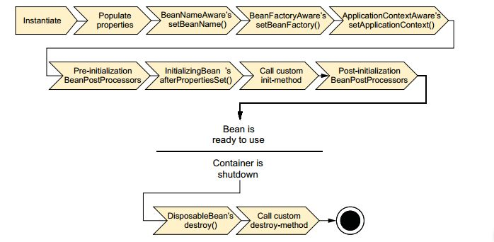
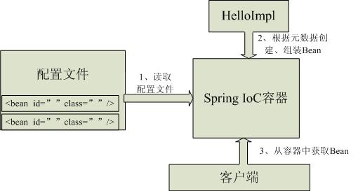

## 介绍

**Spring**是一个开源框架，是一个轻量级的控制反转（IoC）和面前切面（AOP）的容器框架。创建Spring主要是为了解决企业级应用开发的复杂性，简化java开发。为了降低开发的复杂性，Spring采取了以下4种关键策略：

1. 基于POJO的轻量级和最小侵入性编程；
2. 通过依赖注入和面向接口实现松耦合；
3. 基于切面和惯例进行声明式编程；
4. 通过切面和模板减少样板式代码。

spring允许通过分离应用的业务逻辑与系统级服务进行内聚性的开发，并且包含并管理应用对象的生命周期。

<!-- more -->

## Spring作用

1. 容器
2. 提供了对多种技术的支持
   - JMS
   - MQ支持
   - UnitTest
   - ...等
3. AOP（事务管理、日志等）
4. 提供了众多方便应用的辅助类（JDBC Template等）
5. 对主流框架（Hibernate等）提供了良好的支持
6. 构建企业级应用（SpringMVC+Spring+Hibernate/MyBatis）

## Spring框架

Spring官网上给出的框架由6个定义良好的模块分类组成：

### Spring核心容器

管理着Spring应用中bean的创建、配置和管理。在该模块中包括了Spring bean工厂和Spring应用上下文的实现。所有的Spring模块都构建于核心容器之上。

### Spring的AOP模块

在AOP模块中，Spring对面向切面编程提供了丰富的支持。

### 数据访问与集成

Spring基于模板的数据抽象简化样板代码；包含了在JMS之上构建的Spring抽象层，支持消息以异步的方式与其他应用集成；此外，本模块会使用SpringAOP模块为Spring应用中的对象提供事务管理服务。

### WEB与远程调用

构建web应用的MVC模式；提供了多种构建与其他应用交互的远程调用方案。

### Instrumentation

Spring的Instrumentation模块提供了为JVM添加代理（agent）的功能。

### 测试

Spring应用的测试。Spring为使用JNDI、Servlet和Portlet编写单元测试提供了一系列的mock对象实现；对于集成测试，该模块为加载Spring应用上下文中的bean集合以及与Spring上下文中的bean进行交互提供了支持。

## Spring容器

容器是Spring框架的核心。Spring容器负责创建对象，装配对象，配置对象并管理对象的整个生命周期。Spring容器使用DI管理构成应用的组件，创建相互协作的组件之间的关联。Spring自带了多个容器实现，可以归为两种不同的类型：

### bean工厂

bean工厂由<org.springframework.beans.factory.eanFactory>接口定义，是最简单得容器，提供最基本的DI支持。

bean的生命周期：

上图是bean在Spring容器中从创建到销毁经历的若干阶段，每一阶段都可以针对Spring如何管理bean进行个性化定制。

bean容器初始化

- 基础：两个包

  - <org.springframework.beans> BeanFactory提供配置结构和基本功能，加载并初始化Bean
  - <org.springframework.context> ApplicationContext保存了Bean对象并在Spring中被广泛使用

- 方式-ApplicationContext

  - 本地文件

    ~~~java
    FileSystemXmlApplicationContext context = 
      new FileSystemXmlApplicationContext("F:/workspace/appcontext.xml");
    ~~~

  - Classpath

    ~~~java
    ClassPathXmlApplicationContext context = 
      new ClassPathXmlApplicationContext("classpath:spring-context.xml");
    ~~~

  - Web应用中依赖servlet或Listener

    ~~~java
    <listener>
      <listener-class>org.springframework.web.context.ContextLoaderListener</listener-class>
    </listener>
        <servlet>
        	<servlet-name>context</servlet-name>
        	<servlet-class>org.springframework.web.context.ContextLoaderServlet</servlet-class>
            <load-on-startup>1</load-on-startup>
        </servlet>
    ~~~

### 应用上下文

应用上下文由<org.springframework.context.ApplicationContext>接口定义，基于BeanFactory构建，并提供应用框架级别的服务。Spring自带了多种类型的应用上下文：

- <AnnotationConfigApplicationContext>  从一个或多个基于java的配置类中加载Spring应用上下文。
- <AnnotationConfigWebApplicationContext>  从一个或多个基于java的配置类中加载Spring Web应用上下文。
- <ClassPathXmlApplicationContext>  从类路径下的一个或多个XML配置文件中加载上下文定义，把应用上下文的定义文件作为类资源。
- <FileSystemXmlApplicationContext>  从文件系统下的一个或多个XML配置文件中加载上下文定义。
- <XmlWebApplicationContext>  从Web应用下的一个或多个XML配置文件中加载上下文定义。

## IOC

**控制反转**：控制权的转移，应用程序本身不负责依赖对象的创建和维护，而是由外部容器负责创建和维护。（获得依赖对象的过程被反转了）

**DI**：依赖注入是其一种实现方式。目的是创建对象并且组装对象之间的关系。通过DI，对象的依赖关系将由系统中负责协调各对象的第三方组件在创建对象的时候进行设定，对象无需自行创建或管理它们的依赖关系。DI能够让相互协作的软件保持松散耦合。

Spring常用的注入方式：

1. 设值注入-从set方法自动获取

   ~~~java
   <bean id="cdPlayer" class="spring02.assemble.xml.properties.CDPlayer">
       <property name="compactDisc" ref="compactDisc" />
   </bean>
     
   <bean id="compactDisc" class="spring02.assemble.xml.BlankDisc"></bean>
   ~~~

2. 构造注入-从构造器中自动获取

   ~~~java
   <bean id="cdPlayer" class="spring02.assemble.xml.CDPlayer">
       <constructor-arg name = "compactDisc" ref="compactDisc" />
   </bean>
       
   <bean id="compactDisc" class="spring02.assemble.xml.SgtPeppers"></bean>
   ~~~

## AOP

**面向切面编程（aspect-oriented-programming）**：把遍布应用各处的功能分离出来形成可重用的组件。

