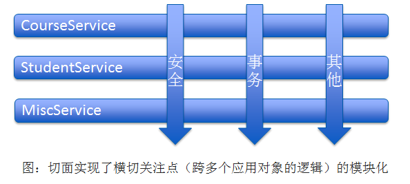
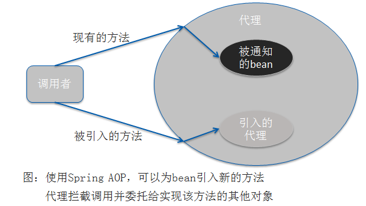

## 介绍

在软件开发中，散布于应用中多处的功能被称为横切关注点（cross-cutting concern）。把这些横切关注点与业务逻辑相分离正是面向切面编程（AOP）所要解决的问题。DI有助于应用对象之间的解耦，而AOP可以实现横切关注点与它们所影响的对象之间的解耦。切面适用的场景包括日志、声明式事务、安全和缓存等。

<!-- more -->

## 面向切面基本原理

切面能帮助我们模块化横切关注点。横切关注点可以被描述为影响应用多处的功能。横切关注点概念图：

切面提供了取代继承和委托的另一种要重用代码功能的可选方案。在使用切面时，我们仍然在一个地方定义通用功能（类似于辅助功能，辅助类），但是可以通过声明的方式定义这个功能要以何种方式在何处应用，而无需修改受影响的类。横切关注点可以被模块化为特殊的类，这些类被称为**切面（aspect）**。这样做的两个好处：

- 每个关注点都集中在了一个地方，而不是分散在多处代码中；
- 服务模块更简洁，它们只包含关注点（或核心代码），而次要关注点的代码被转移到了切面中。

## 通过切点来选择连接点

切点用于准确定位应该在什么地方应用切面的通知。在Spring AOP 中，使用AspectJ的切点表达式语言来定义切点。 重点是Spring仅支持AspectJ切点指示器（pointcut designator）的一个子集，因为Spring是基于代理的，而某些切点表达式是与基于代理的AOP无关的。Spring AOP 所支持的AspectJ切点指示器：

| AspectJ指示器  |                    描述                    |
| :---------: | :--------------------------------------: |
|    arg()    |           限制连接点匹配参数为指定类型的执行方法            |
|   @args()   |          限制连接点匹配参数由指定注解标注的执行方法           |
| execution() |              用于匹配是连接点的执行方法               |
|   this()    |        限制连接点匹配AOP代理的bean引用为指定类型的类        |
|   target    |            限制连接点匹配目标对象为指定类型的类            |
|  @target()  |     限制连接点匹配待定的执行对象这些对象对应的类要具有指定类型的注解     |
|  within()   |               限制连接点匹配指定的类型               |
|  @within()  | 限制连接点匹配指定注解所标注的类型（aop中，方法定义在由指定的注解所标注的类里） |
| @annotation |              限定匹配带有指定注解的连接点              |

在Spring中使用AspectJ其他指示器时，将会抛出IllegalArgumentException异常。

### 编写切点

一个Performance接口：

~~~java
package concert;
public interface Performance{
  	public void perform();
}
~~~

使用AspectJ切点表达式来当perform方法执行时触发通知的调用：

~~~java
/*
 * 1. * 表示返回任意类型
 * 2. concert.Performance.perform() 全限定的类名和方法名
 * 3. .. 表示任意参数
 */
execution(* concert.Performance.perform(..))

//限定仅匹配concert包
execution(* concert.Performance.perform(..)) && within(concert.*)
/*&在XML中有特殊含义，所以在Spring的XML配置里面描述切点可以用 and,or,not代替&&,||*/
  
//限定切点只匹配特定的bean,bean()使用bean ID或bean名称作参数
execution(* concert.Performance.perform(..)) and bean('woodstock')
execution(* concert.Performance.perform(..)) and !bean('woodstock')
~~~

## 使用注解创建切面

使用注解来创建切面是AspectJ5所引入的关键特性。Spring使用AspectJ注解来声明通知方法：

|       注解        |          通知          |
| :-------------: | :------------------: |
|     @After      | 通知方法会在目标方法返回或抛出异常后调用 |
| @AfterReturning |    通知方法会在目标返回后调用     |
| @AfterThrowing  |  通知方法会在目标方法抛出异常后调用   |
|     @Around     |    通知方法会将目标方法封装起来    |
|     @Before     |   通知方法会在目标方法调用之前执行   |

例：一个观看演出的切面：

~~~java
/**
 * 观众：观看演出的切面
 * 使用@Pointcut注解定义可重用的切点
 * @author guangguang_duan
 *
 */
@Aspect
public class AudienceUsePointcut {
	 
	 @Pointcut("execution(** spring04.aop.Performance.perform(..))")
	 public void performance(){
		 //没有实际操作的方法，供@Pointcut注解依附的标识
	 }
	
	 //表演之前
	 @Before("performance()")
	 public void silenceCellPhones(){
		 System.out.println("Silencing cell phones");
	 }
	 
	 //表演之前
	 @Before("performance()")
	 public void takeSeats(){
		 System.out.println("Taking seats");
	 }
	 
	 //表演之后
	 @AfterReturning("performance()")
	 public void applause(){
		 System.out.println("CLAP CLAP CLAP!!!");
	 }
	 
	 //表演失败之后
	 @AfterThrowing("performance()")
	 public void demandRefund(){
		 System.out.println("Demanding a refund");
	 }
}

~~~

这样AudienceUsePointcut依然是一个POJO，能够像其他java类一样调用它的方法，也可以将它装配为spring中的bean：

~~~java
@Bean
public AudienceUsePointcut audience(){
  return new AudienceUsePointcut();
}
~~~

它通过注解表明会作为切面使用，下面进行注解的解析，将它转换成一个切面。

在javaConfig中启用AspectJ注解的自动代理：

~~~java
@Configuration
@EnableAspectJAutoProxy    //启用AspectJ自动代理
@ComponentScan
public class ConcertConfig {

	@Bean
	public Audience audience(){ //声明Audience bean
		return new Audience();
	}
}
~~~

在XML中，通过Spring的aop命名空间启用AspectJ自动代理：

~~~java
<context:component-scan base-package="spring04.aop" />
<aop:aspectj-autoproxy />                    <!-- 启用AspectJ自动代理 -->
<bean class="spring04.aop.Audience" />       <!-- 声明Audience bean -->
~~~

不管使用何种方式，AspectJ自动代理都会为使用@Aspect注解的bean创建一个代理，这个代理会围绕着所有该切面的切点所匹配的bean。

需要记住的是，Spring的AspectJ自动代理仅仅使用@AspectJ作为创建切面的指导，切面依然是基于代理的。在本质上，它依然是spring基于代理的切面。这意味着尽管使用的是@AspectJ注解，但我们仍然限于代理方法的调用。如果想利用AspectJ的所有能力，我们必须在运行时使用AspectJ并且不依赖Spring来创建基于代理的切面。

### 环绕通知

环绕通知是最强大的通知，它能让所编写的逻辑将被通知的目标方法完全包装起来，实际上就像在一个通知方法中同时编写前置通知和后置通知。

~~~java
public class AudienceUseAround {
	 @Pointcut("execution(** spring04.aop.Performance.perform(..))")
	 public void performance(){
		 //没有实际操作的方法，供@Pointcut注解依附的标识
	 }
	 
	 @Around("performance()")
	 public void watchPerformance(ProceedingJoinPoint jp){
		 try {
			 System.out.println("Silencing cell phones");
			 System.out.println("Taking seats");
			 jp.proceed();
			 System.out.println("CLAP CLAP CLAP!!!");
		} catch (Throwable e) {
			System.out.println("Demanding a refund");
		}
	 }
}
~~~

可以看到这个通知所达到的效果与之前的前置通知和后置通知是一样的。它接受ProceedingJoinPoint作为参数，这个对象用来在通知中调用被通知的方法。如果不调用proceed()这个方法，那么通知实际上会阻塞对被通知方法的调用。也可以多次调用，这样做的一个场景就是重试逻辑，在通知方法失败后，进行重试尝试。

### 处理通知中的参数

下面看一下切面所通知的方法带有参数的处理过程：记录每个磁道播放的次数。

~~~java
@Aspect
public class TrackCounter {

	private Map<Integer, Integer> trackCounts = new HashMap<Integer,Integer>();
	/*
	 * 接受int类型参数，并使用args指定参数为trackNumber
	 * args(trackNumber)限定符表明，传递给playTrack方法的int类型参数也会传递到通知中，
	 * 参数的名称也与切点方法签名中的参数相匹配
	 */
	@Pointcut("execution(* spring04.aop.playTrack(int))" + "&& args(trackNumber)")
	public void trackPlayed(int trackNumber){}
	
	@Before("trackPlayed(trackNumber)")
	public void countTrack(int trackNumber){
		int currentCount = getPlayCount(trackNumber);
		trackCounts.put(trackNumber, currentCount + 1);
	}
	
	public int getPlayCount(int trackNumber){
		return trackCounts.containsKey(trackNumber) ? trackCounts.get(trackNumber) : 0;
	}
}
~~~

然后在Spring配置中，将BlankDisc和TrackCounter定义为bean，并启用AspectJ自动代理：

~~~java
@Configuration
@EnableAspectJAutoProxy    //启用AspectJ自动代理
public class TrackCounterConfig {

	@Bean
	public CompactDisc sgtPeppers(){
		BlankDisc cd = new BlankDisc();
		cd.setTitle("Sgt. Pepper's Lonely Hearts Club Band");
		cd.setArtist("The Beatles");
		List<String> tracks = new ArrayList<String>();
		tracks.add("Love song");
		tracks.add("sheng ri kuai le");
		tracks.add("xiao chou");
		tracks.add("ni jiu bu yao xiang qi wo");
		cd.setTracks(tracks);
		return cd;
	}
	
	@Bean
	public TrackCounter trackCounter(){
		return new TrackCounter();
	}
}
~~~

测试并断言播放的数量：

~~~java
@RunWith(SpringJUnit4ClassRunner.class)
@ContextConfiguration(classes=TrackCounterConfig.class)
public class TrackCounterTest {

	  @Autowired
	  private BlankDisc cd;
	  
	  @Autowired
	  private TrackCounter counter;
	  
	  @Test
	  public void testTrackCounter(){
		  cd.playTrack(1);
		  cd.playTrack(2);
		  cd.playTrack(2);
		  cd.playTrack(3);
		  cd.playTrack(3);
		  cd.playTrack(3);
		  
		  assertEquals(1, counter.getPlayCount(1));
		  assertEquals(2, counter.getPlayCount(2));
		  assertEquals(3, counter.getPlayCount(3));
	  }
}
~~~

### 通过注解引入新功能

在Spring中，切面只是实现了它们所包装bean相同接口的代理，除了实现这些接口，代理也能暴露新接口。下图展示Spring AOP 通过引入为Spring bean添加新方法：

当引入接口的方法被调用时，代理会把此调用委托给实现了新接口的某个其他对象。实际上，一个bean的实现被拆分到了多个类中。示例：为所有的Performance实现引入下面的Encoreable接口：

~~~java
public interface Encoreable {
	void performEncore();
}
~~~

借助AOP引入功能，我们不必修改所有的实现让其都实现Encoreable接口，下面创建一个新的切面：

通过@DeclareParents注解将Encoreable接口引入到Performance bean中

~~~java
@Aspect
public class EncoreableIntroducer {
	/*
	 * @DeclareParents注解由三个部分组成：
	 * 1. value：指定了哪种类型的bean要引入该接口。+表示Performance的所有子类型，而不是Performance本身。
	 * 2. defaultImpl：指定了为引入功能提供实现的类。
	 * 3. @DeclareParents注解所标注的静态属性指定了要引入的接口。
	 */
	@DeclareParents(value="spring04.aop.Performance+", defaultImpl=DefaultEncoreable.class)
	public static Encoreable encoreable;
}
~~~

和其他切面一样，我们需要在spring应用中将EncoreableIntroducer声明为一个bean：

~~~java
<bean class="spring04.aop.EncoreableIntroducer" />
~~~

Spring的自动代理机制将会获取到它的声明，当Spring发现一个bean使用了@Aspect注解时，Spring就会创建一个代理，然后将调用委托给被代理的bean或被引入的实现，这取决于调用的方法属于被代理的bean还是被引入的接口。

在Spring中，注解和自动代理提供了一种很便利的方式来创建切面。但面向注解的切面声明有一个明显的劣势就是，必须要有源码，才能为通知的类添加注解。所以当你没有源码，或者不想将AspectJ注解放到代码中时，就需要在Spring XML配置文件中声明切面。

## 在XML中声明切面

在Spring的aop命名空间中，提供了多个元素用来在XML中声明切面。如下：

|         AOP配置元素         |            用途             |
| :---------------------: | :-----------------------: |
|      <aop:advisor>      |         定义AOP通知器          |
|       <aop:after>       | 定义AOP后置通知（不管被通知的方法是否执行成功） |
|  <aop:after-returning>  |         定义AOP返回通知         |
|  <aop:after-throwing>   |         定义AOP异常通知         |
|      <aop:around>       |         定义AOP环绕通知         |
|      <aop:aspect>       |          定义一个切面           |
| <aop:aspectj-autoproxy> |     启用@AspectJ注解驱动的切面     |
|      <aop:before>       |        定义一个AOP前置通知        |
|      <aop:config>       |        顶层的AOP配置元素         |
|  <aop:declare-parents>  |   以透明的方式为被通知的对象引入额外的接口    |
|     <aop:pointcut>      |          定义一个切点           |

~~~java

~~~

### 声明前置和后置通知

XML配置下的Audience类：

~~~java
public class Audience {	
	 public void silenceCellPhones(){
		 System.out.println("Silencing cell phones");
	 }
	 
	 public void takeSeats(){
		 System.out.println("Taking seats");
	 }
	 
	 public void applause(){
		 System.out.println("CLAP CLAP CLAP!!!");
	 }
	 
	 public void demandRefund(){
		 System.out.println("Demanding a refund");
	 }
}
~~~

xml配置：

~~~java
<aop:config>
    <aop:aspect ref="audience">
    	<aop:pointcut id="performance" expression="execution(** spring04.aop.Performance.perform(..))"/>
    		
    	<aop:before 
    		 pointcut-ref="performance"
    		 method="silenceCellPhones" />
    		
    	<aop:before 
    		 pointcut-ref="performance"
    		 method="takeSeats" />
    	
    	<aop:after-returning 
    		 pointcut-ref="performance"
    		 ethod="applause" />
    		     
    	<aop:after-throwing 
    		 pointcut-ref="performance"
    		 method="demandRefund" />
    </aop:aspect>
</aop:config>
~~~

如果想让定义的切点能够在多个切面使用，可以把<aop:pointcut>元素放在<aop:config>元素的范围内。

### 声明环绕通知

假设除了进场关闭手机和表演结束鼓掌，我们还希望观众确保一直关注演出，并报告每个表演者的演出时间。使用前置通知和后置通知实现该功能的唯一方式是在前置通知中记录开始时间并在某个后置通知中报告表演耗费的时间。但这样的话必须在一个成员变量中保存开始时间。因为Audience是单例的，如果像这样保存状态的话，将会存在线程安全问题。这时可以环绕通知就很有优势。

XML配置下使用环绕通知的AudienceUseAround类：

~~~java
public class AudienceUseAround {
	 public void watchPerformance(ProceedingJoinPoint jp){
		 try {
			 System.out.println("Silencing cell phones");
			 System.out.println("Taking seats");
			 jp.proceed();
			 System.out.println("CLAP CLAP CLAP!!!");
		} catch (Throwable e) {
			System.out.println("Demanding a refund");
		}
	 }
}
~~~

xml配置：

~~~java
<aop:config>   
    	<aop:aspect ref="audienceUseAround">
    		<aop:pointcut 
    		     id="performance" 
    		     expression="execution(** spring04.aop.Performance.perform(..))"/>
    	
    		<aop:around 
    		     pointcut-ref="performance"
    			 method="watchPerformance" />
    	</aop:aspect>
    </aop:config>
~~~

### 为通知传递参数

在XML中实现：记录每个磁道播放的次数。

无注解的TrackCounter：

~~~java
public class TrackCounter {
	private Map<Integer, Integer> trackCounts = new HashMap<Integer,Integer>();
	public void countTrack(int trackNumber){
		int currentCount = getPlayCount(trackNumber);
		trackCounts.put(trackNumber, currentCount + 1);
	}
	public int getPlayCount(int trackNumber){
		return trackCounts.containsKey(trackNumber) ? trackCounts.get(trackNumber) : 0;
	}
}
~~~

在XML中将TrackCount配置为参数化的切面：声明TrackCount bean和BlankDisc bean，并将TrackCount转化为切面。

~~~java
<!-- 在XML中将TrackCount配置为参数化的切面 -->  
    <!-- 声明TrackCounter bean和BlankDisc bean -->
    <bean id = "trackCounter" class = "spring04.aop.xml.TrackCounter" />
    <bean id = "cd" class = "spring04.aop.BlankDisc">
    	<property name="title" value = "Sgt. Pepper's Lonely Hearts Club Band" />
    	<property name="artist" value = "The Beatles" />
    	<property name="tracks">
    		<list>
    			<value>Love song</value>
    			<value>sheng ri kuai le</value>
    			<value>xiao chou</value>
    			<value>ni jiu bu yao xiang qi wo</value>
    		</list>
    	</property>
    </bean>
    
    <!-- 将TrackCount声明为切面 -->
    <aop:config>   
    	<aop:aspect ref="trackCounter">
    		<aop:pointcut 
    		     id="trackPlayed" 
    		     expression="execution(* spring04.aop.CompactDisc.playTrack(int)) and args(trackNumber)"/>
    	
    		<aop:before 
    		     pointcut-ref="trackPlayed"
    			 method="countTrack" />
    	</aop:aspect>
    </aop:config>
~~~

注意：在XML中切点表达式需要使用and、or、not，不要使用&&、||、!。

### 通过切面引入新的功能

如下的XML代码与之前基于AspectJ的引入功能相同：

~~~java
<aop:aspect>
	<aop:declare-parents 
		types-matching="spring04.aop.Performance+" 
		implement-interface="spring04.aop.Encoreable"
		default-impl="spring04.aop.DefaultEncoreable" /> //Encoreable接口中的方法实现来源
</aop:aspect>  
  
//引入接口的实现还有另一种方式
<bean id="encoreableDelegate" class="spring04.aop.DefaultEncoreable" />
<aop:aspect>
	<aop:declare-parents 
		types-matching="spring04.aop.Performance+" 
		implement-interface="spring04.aop.Encoreable"
		delegate-ref="encoreableDelegate"  /> 
</aop:aspect> 
~~~

使用default-impl来直接标识委托和间接使用delegate-ref的区别在于后者是Spring bean，它本身可以被注入、通知或使用其他的Spring配置。

